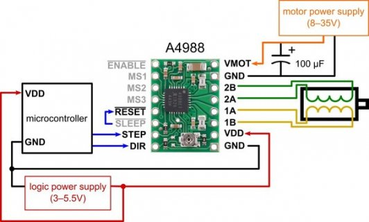
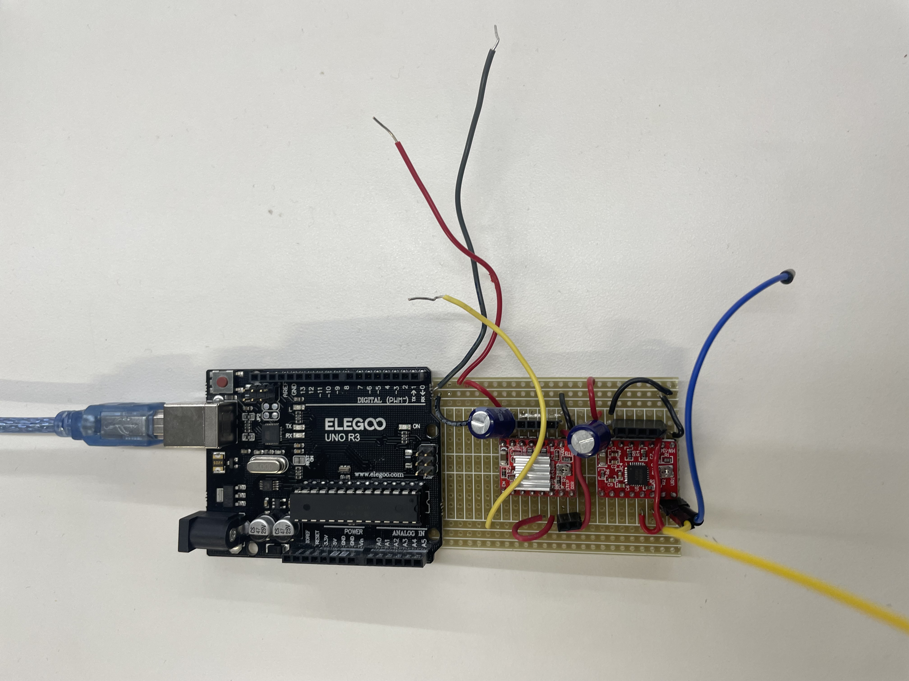
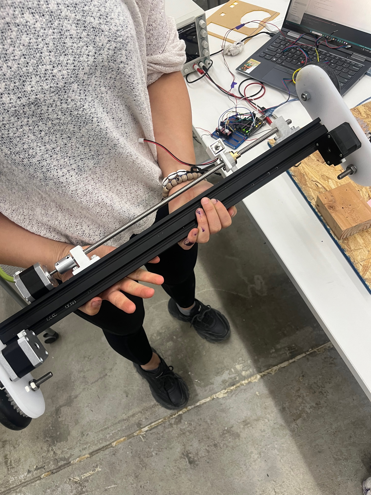
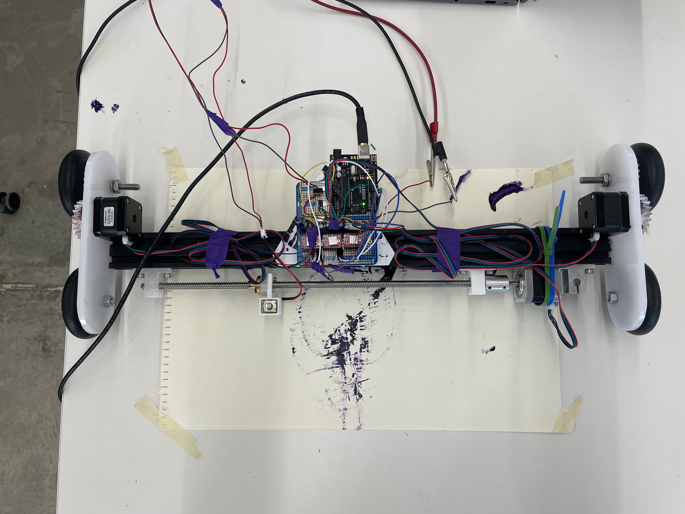

# Drawing Machine

Brought to you by: Yao, Chris, Chenjie, and Azhaan

For our drawing robot, we wanted to create something that could recreate pixel art. Our base goal was to create a robot that would use a stamp of sorts to create square imprints on a page, creating a "grid" of stamps to form an image.

This project required 3 main parts:

1. Assembling a frame to move our "stamp" on a 2x2 grid
2. Controlling the stepper motors to move through that grid
3. Getting the end effector (stamp) to end effect (stamp)
4. Integrating all the parts

### Creating the Frame

For this step, we used this [assembly](https://www.youtube.com/watch?v=5tGBE674HGU) as our inspiration, using two total stepper motors to control the movement, with a belt helping to advance the jig.

There were three main challenges with assembling this. The first challenge was learning how to assemble components at all, getting used to working with aluminum extrusion and the existing pieces we had access to. There was a big mental click we had to make to move from creating 3D-printed assemblies to working on larger projects that required 3D printing, not for their construction but for interfacing pieces more securely.

    
    
    

        The second challenge was creating the second axis of motion. Advancing the center black aluminum extrusion was fairly doable, but advancing the end effector along that extrusion proved more difficult.
    

    
    

Initially, we were going to draw on the design in the video mentioned above and created two gears that would translate the rotation between the two axes. This proved to be much more difficult to mount securely than attaching the second stepper motor to the X-axis.

The third challenge was creating a piece that can move along a threaded rod. We created two main pieces to help with this. The first was used to fix the threaded lead screw caps in a way that would advance if the rod was turned. The second was to do the same but to advance the end effector, requiring a moving attachment. This was fun to design.

    
    

        The final piece was used to fix the threaded lead screw caps in a way that would advance if the rod was turned. The second was to do the same but to advance the end effector, requiring a moving attachment.
    

### Controlling the Stepper Motors

We had hoped that the stepper motors would be easy to work with since the other motors we had worked with were reasonably straightforward too. Simply getting the steppers to turn required significantly more wiring and trial and error.

    
    
    

        After a few hours, we stumbled upon the correct configuration through sheer luck and were finally able to get the stepper motor to go from "BBBZZZZZZZZZZ" and "ZZPP ZPPP ZZZP" to rotating smoothly through the steps. Once this was done, we created a soldered board with much more reliable connections.
    

    
    

        We had hoped that the stepper motors would be easy to work with since the other motors we had worked with were reasonably straightforward too. Simply getting the steppers to turn required significantly more wiring and trial and error.
    

### Getting the Stamp to Stamp

Work on the stamp was moving parallel to the rest of the assembly. We were able to get the solenoid to move up and down and created a mount for it too. The silicone for the stamp was a decent enough stamp, and we were able to get an ink pad for the stamp to "re-ink" itself.

### Integrating the Components

This was where we met our end. Integrating all of this required all of these individual components to work together and programming to turn a grid into a traversable path for the robot.

    
    

We weren't able to move past getting the physical components to work together. Trying to get the stepper motor to turn the rods was an issue. There were issues. Our guess is that there's too much friction on the Y-axis rods because the X-axis rod was turning fairly successfully. We know that at least the stepper motors are working. We were also able to get the Y-axis rods to turn under specific conditions. We needed to hold the motor tight and put extra tension on the belt.

### Second Attempt

    

The initial version of the drawing machine encountered many obstacles in mobility. The primary challenge was rod alignment. When the rods were not parallel to each other, excessive friction impeded the motor's ability to drive rotation. The rods remain stationary when the motors are on. Manually adjusting rod alignment proves difficult and time-consuming, so we began exploring alternative solutions.

We found that the support system, comprising the four wooden blocks elevating the rods and multiple metal brackets securing them, was very ineffective due to misalignment issues. Consequently, we opted to change our design of the support system.

    <video controls width="50%">
        <source src="../img/drawingMachine/IMG_3368.mp4" type="video/mp4">
    </video>
    <video controls width="50%">
        <source src="../img/drawingMachine/IMG_3365.mp4" type="video/mp4">
    </video>

We retained the X-axis system as it worked perfectly with the motor. However, for the Y-axis, we transitioned from four wood blocks with rods to a configuration employing four wheels, so we did not need to worry about any issues of alignment or friction.

Two motors will actuate the gears, which will drive the wheels to move.

    
    <video controls width="50%">
        <source src="../img/drawingMachine/IMG_9786.mp4" type="video/mp4">

Then we ensured the proper functionality of the original X-axis and stamp system. Finally, we assembled all components and calibrated the circle, enabling the drawing machine to draw a "circle" successfully.

    <video controls width="50%">
        <source src="../img/drawingMachine/IMG_9819.mp4" type="video/mp4">
    </video>
    <video controls width="50%">
        <source src="../img/drawingMachine/IMG_9822.mp4" type="video/mp4">
    </video>

The machine looked very different from its previous iteration, but we only modified the supporting system and replaced the Y-axis rods with four wheels. Now, the machine can move smoothly without friction or irritating noise resulting from rods' rotation.

Arduino code see below. [The code is also here](https://github.com/yaosarayin/Arduino/blob/main/drawing-machine/drawing-machine.ino).

<button class="copy-button" onclick="copyCode('example-code')">Copy</button>
<code id="example-code">
        // Define pin connections
        const int dir1 = 2;
        const int step1 = 3;

        const int dir2 = 4;
        const int step2 = 5;

        const int dir3 = 7;
        const int step3 = 6;

        const int stampPIN = 9;  

        struct Coordinates {
        float x;
        float y;
        };

        #include <AccelStepper.h>
        #include <MultiStepper.h>

        // Define some steppers and the pins the will use
        // AccelStepper stepper1; // Defaults to AccelStepper::FULL4WIRE (4 pins) on 2, 3, 4, 5
        AccelStepper stepper1(1, step1, dir1);
        AccelStepper stepper2(1, step2, dir2);
        AccelStepper stepper3(1, step3, dir3);

        MultiStepper steppers;

        int len = 7200; // maximum is position closest to motor, total length of rod to run

        int cx = 3300;
        int cy = 0;
        int cr = 10000;
        // Define variables
        const int numPoints = 100;
        float angleIncrement = 2 * PI / numPoints;
        float angles[numPoints];

        // int top = 10000;
        // int step;
        // int Hpos;
        // int Vpos;
        // int Hpositions[] = {200, 800, 2400, 3600, 4000, 6600}; // horizontal motor positions
        // int Vpositions[] = {10, 20, 30, 40, 50, 60}; // horizontal motor positions
        // int ind = 0; // index

        void setup()
        {  
            Serial.begin(115200); // Set baud rate to 9600

            pinMode(stampPIN, OUTPUT);     // specify these pins as outputs

            stepper1.setMaxSpeed(50);
            stepper1.setAcceleration(50);
            stepper1.setSpeed(50);

            stepper2.setMaxSpeed(50);
            stepper2.setAcceleration(50);
            stepper2.setSpeed(50);
        
            stepper3.setMaxSpeed(1000.0);
            stepper3.setAcceleration(1000.0);
            stepper3.setSpeed(1000);

            // Then give them to MultiStepper to manage
            steppers.addStepper(stepper1);
            steppers.addStepper(stepper2);
            steppers.addStepper(stepper3);

            // long positions[3]; // Array of desired stepper positions

            // Move to a different coordinate

            stepper3.runToNewPosition(len); // This will home it to nearest to the motor wherever it is!
            stepper3.runToNewPosition(0); // This will home it to nearest to the motor wherever it is!
            stepper1.setCurrentPosition(0);
            stepper2.setCurrentPosition(0);
            stepper3.setCurrentPosition(0);

            // dip ink
            digitalWrite(stampPIN, HIGH);   // start with the motors off
            delay(200);
            digitalWrite(stampPIN, LOW);
            delay(200);

            // stepper1.setMaxSpeed(300.0);
            // stepper1.setAcceleration(100.0);
            // stepper1.moveTo(1000);
            // if (stepper2.currentPosition() >= len) {
            //   pos = 0;
            // }
            // else if (stepper2.currentPosition() <= 0) {
            //   pos = len;
            // }

            // Populate the array with equally spaced angles
            for (int i = 0; i < numPoints; i++) {
            angles[i] = i * angleIncrement;
            }
        }
        
        void loop()
        {
            // Change direction at the limits
            // if (stepper1.distanceToGo() == 0)
            //     stepper1.moveTo(-stepper1.currentPosition());
            // if (stepper2.distanceToGo() == 0)
            //   // stepper2.runToNewPosition(-stepper2.currentPosition());
            //   stepper2.moveTo(-stepper2.currentPosition());
            // while (ind < 5) {
            //   Hpos = Hpositions[ind];
            //   Vpos = Vpositions[ind];
            //   stepper1.moveTo(Vpos);
            //   stepper2.moveTo(-Vpos);
            //   stepper1.run();
            //   stepper2.run();

            //   stepper3.runToNewPosition(Hpos);

            //   ind += 1;
            //   digitalWrite(stampPIN, HIGH);   // start with the motors off
            //   delay(20);
            //   digitalWrite(stampPIN, LOW);
            //   delay(200);
            // }
            long positions[3]; // Array of desired stepper positions

            // Loop through the angles array to draw a circle
            for (int i = 0; i < numPoints; i++) {
            // Do something with each angle, for example:
            long xcoord = getXCircleCoord(1000, angles[i], cx);
            long ycoord = getYCircleCoord(100, angles[i], cy);

            // Move to a different coordinate
            positions[0] = ycoord;
            positions[1] = -ycoord;
            positions[2] = xcoord;

            Serial.println(angles[i]);
            Serial.print("x: ");
            Serial.println(xcoord);
            Serial.print("y: ");
            Serial.println(ycoord);
            
            // stepper3.runToNewPosition(xcoord);
            steppers.moveTo(positions);
            steppers.runSpeedToPosition(); // Blocks until all are in position
            // stamp!
            digitalWrite(stampPIN, HIGH);   // start with the motors off
            delay(20);
            digitalWrite(stampPIN, LOW);
            delay(200);
            }
            // pos = pos + step;
            // stepper2.moveTo(pos);
            // // stepper1.run();
            // delay(20);
        }

        long getXCircleCoord(float r, float theta, float centerx) {
        long x = r * cos(theta) + centerx;
        return x;
        }

        long getYCircleCoord(float r, float theta, float centery) {
        long y = r * sin(theta) + centery;
        return y;
        }

</code>

