# Final Project # 1: A Small Drone

### <a href="https://github.com/yaosarayin/Arduino/tree/main/drone">Code used in the drone final project see my Github here.</a>

## Major Obstacle 1: Power & Size Design
When I started planning for my final project I went down a rabit hole of trying to find the best components to use. Little did I know, most of the information online about "how to build a drone" are based on First Person View(FPV) long range drones with brushless motors and require multiple cells of battery. However, we are not really recommemded to use multicell batteries in PS70 due to safety concerns and the lack of way to charge them. I initially thought that it would be impossible to make one fly with single cell batteries and forgot to think outside of the box. Yet when I talked to Nathan, he was like "well there are a lot of kids drones that you can buy on Amazon that only use single cell batteries..." I was like, Yao did you seriously not think about this...anyways...

I am still putting the resources I found for making a multicell drone in the appendix at the very end of this page. Maybe I will make one at some point in the future.

Nathan ended up purchasing a small cheap kids drone on Amazon for me and at that point, I envision my final project to entail simple 3 steps:

**Overly-simplified plan:**

1. Take apart drone. Steal the motors and propellers of bought drone.
2. Remake the rest of drone.
3. Make it fly.

Well, as expected, the third step took disporportionally longer than the other 2, and I encountered many obstacles on the way. The last obstacle is still not fully resolved as of now. But I think I have came a long way and learned a lot.

# Step 1: Buy drone and take apart drone

        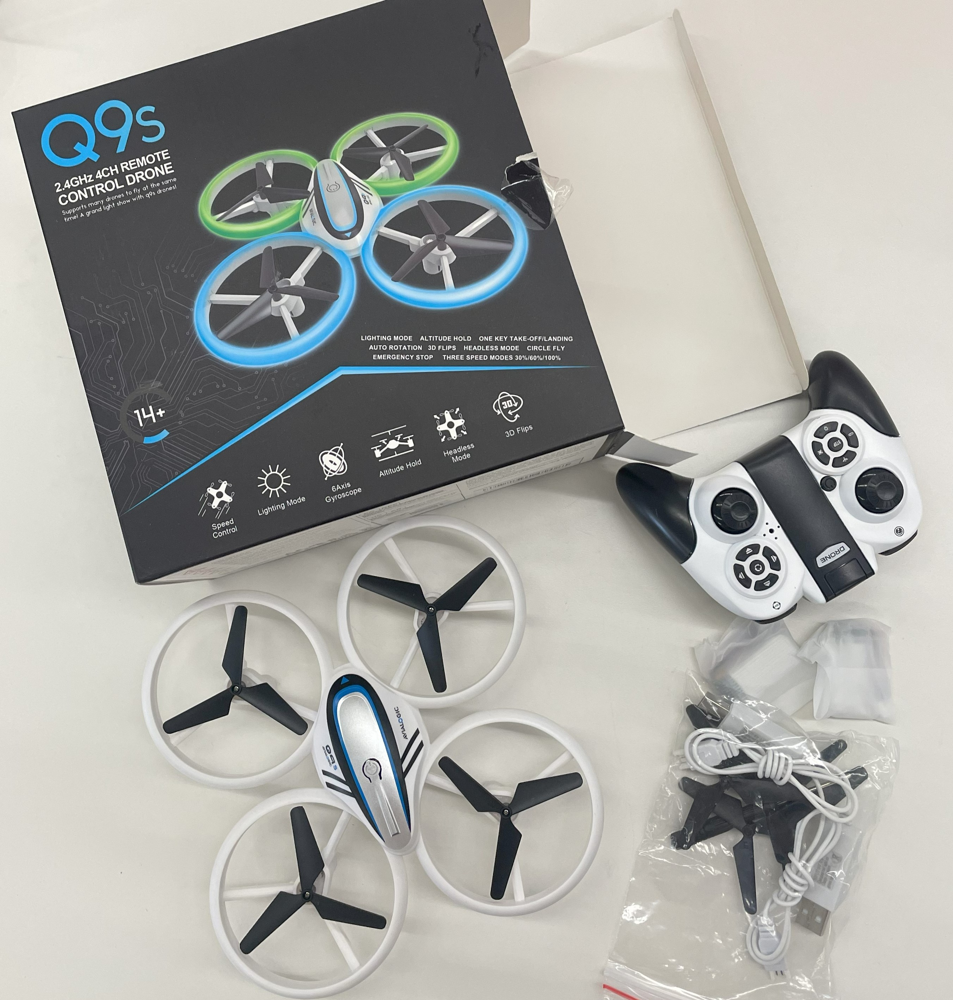
        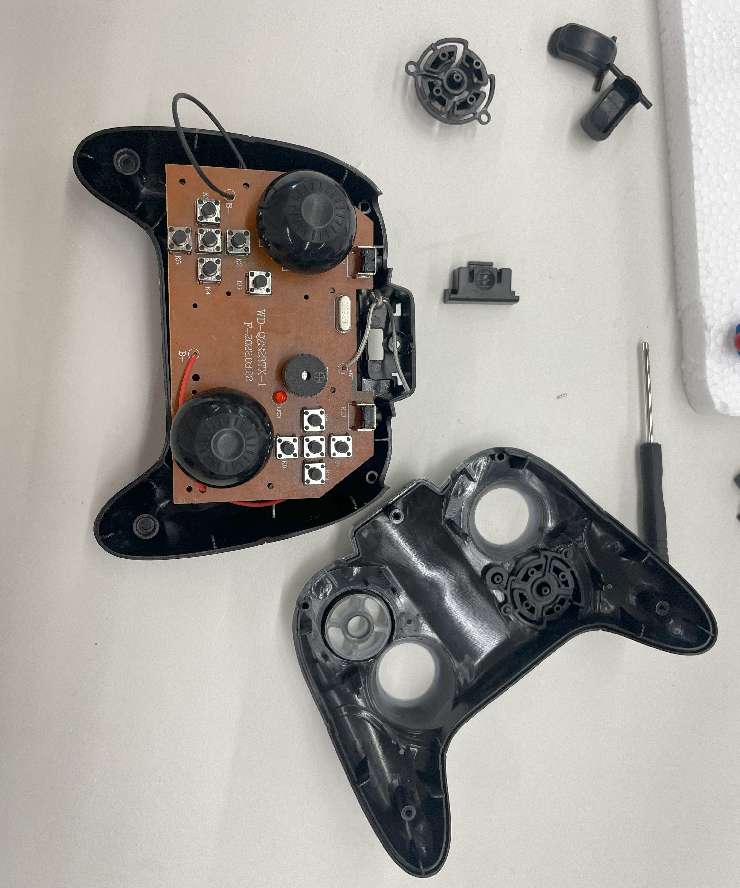
    
We got this small kids drone from <a href="https://www.amazon.com/Altitude-Headless-Quadcopter-Propellers-Batteries/dp/B07T2P9ZGH/ref=sr_1_1_sspa?crid=1J8NYNO5VOEGZ&dib=eyJ2IjoiMSJ9.1JUclSvfKSa504LtQHMbQKybXx4PX5HpEAwIxJYnoZRV461OMK6iMYhzaCAZCyGRlHAZR8PyCFPtUvAqyyXs5ZUVXUhrtLoOLvSagC_hYLL5Niq0biLuWy7iRhQxNiwcOKODrQ9_rPvrhJSjm70Gd5wnUY3O2XaD5jBHqLJWD6m283T1ljrOka5h62UGk8wCO6HZNyoOVY2zEl_Vh3PltfejJN1mNPrHf8LxaVRGtF2pFh-UNo16zy6EMgo7SE7jrDDWrHiXWmZHD2RxRzImBfKac2Ke_RB-0lCMACIKbYQ.pSDFDKOf6MJW0V-Ju8IaLd7SRmMfaf2Jz22wEBy-hH8&dib_tag=se&keywords=QS9+drone&qid=1710094334&sprefix=qs9+drone%2Caps%2C79&sr=8-1-spons&sp_csd=d2lkZ2V0TmFtZT1zcF9hdGY&psc=1">THIS AMAZON LINK</a>. I simply unscrewed everything and de-soldered everything to take it apart. The images here show what the drone looks like and what the controller looks inside after I take it apart.

# Step 2: Remake the rest of drone.

        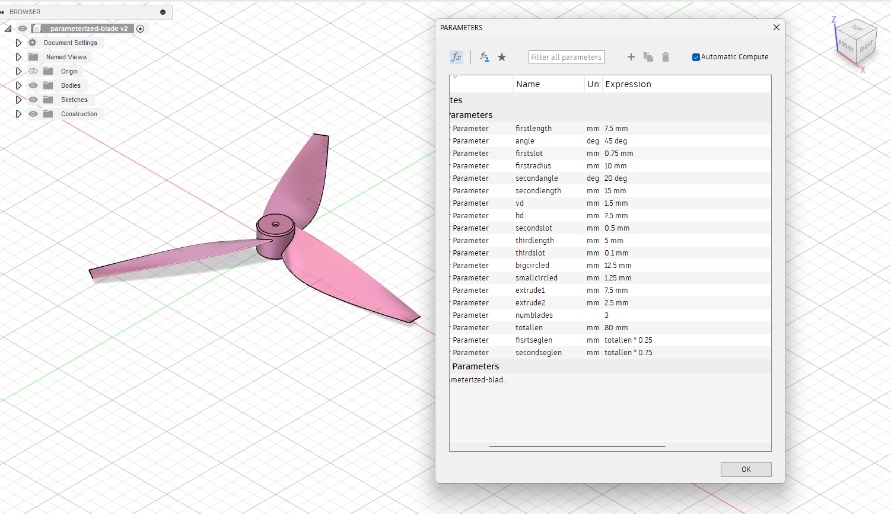
    
 So I was initially pl;anning to make my own propellers by 3D printing them. I made a fully parameterized fusion design that allows me to change the number of blades and the size of them very easily (see image on the left for a screenshot of the design in Fusion). I did ended up printing a couple of these but I realized that the surface roughness of the Prusa 3D printed models would not pass. The surfaces of useable propellers for my small drone should be as smooth as possible to maximize the motor efficiency and  minimize drag. 

Even though custom 3D printed ones could potentially work if I really worked on optimizing them, I decided that stealing the propellers that came with the tiny bought drone that we know would work for a drone of this size with the battery would be a better choice. Afterall, my goal is not to fully understand the aerodynamics of propellers in this project. So the remaking of the drone is now reduced to making 1) the electronics and 2) the frame.

    
 Out of all the microcontroller boards that we have available in the lab, I decided to go with the **XIAO_ESP32C3 made by Seed Studio** due to its size and its support for WiFi and Bluetooth and radio . Here is a pinout of the XIAO.

     

The first step was to setup radio communication between two XIAOs. I managed to accomplish this using [ESP-NOW](https://randomnerdtutorials.com/esp-now-esp32-arduino-ide/). I press a button to send a message from the controller to the reciever and a motor can turn on and off. Again, the code that I have been using are all in [my Github](https://github.com/yaosarayin/Arduino/tree/main/drone). 

The only problem I had with this step was merely software related. At one point I saw a 3.78 second delay to turn on/off the motor after pressing/releasing the button. I quickly realized that this was due to me sending data all the time in the loop() function instead of only sending when the button has been pressed or released. I fixed it by making it a state machine instead of sending data all the time.

 

     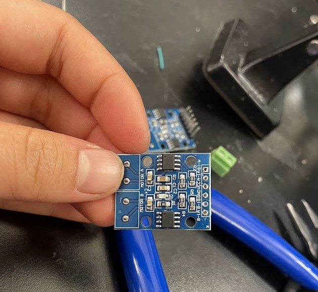 
    

     At this stage, I was quite optimistic about the project. I made a simple circuit board with two motor L9110 H-Bridges (4 L9110 motor drivers total) connecting to a XIAO. I thought I would be able to finish this project in no time....I was also considering optimizing by ordering PCBs to minimizew the weight and size of the circuit. Here is an image of a H-bridge that I stripped naked for my soldered board.
    

YET LITTLE DID I KNOW....

### Major Obstacle 2: the moody XIAO ESP32C3 

Unfortunately, when I just started out working with the XIAO consistently, I spent a minimum of two weeks banging my head against the imaginary wall everytime I need to upload code to the XIAO. There are several error messages that I have seen before and have documented in previous week's projects. But in the XIAO it seems a lot more prevalent. Basically, when I was having this issue, the Arduino code only uploads successfully 1 out of every 10 times. I was very confused and very frustrated. 

Here are the common errors that I encountered and we tried at first:

1. Serial Exception Error: Write Timeout

<button class="copy-button" onclick="copyCode('example-code')">Copy</button>
<code id="example-code">
A serial exception error occurred: Write timeout
Note: This error originates from pySerial. It is likely not a problem with esptool, but with the hardware connection or drivers.
Troubleshooting Steps: Visit the [Espressif troubleshooting guide](https://docs.espressif.com/projects/esptool/en/latest/troubleshooting.html).
Failed uploading: uploading error: exit status 1
</code>

2. Fatal Error: Chip Stopped Responding

<button class="copy-button" onclick="copyCode('example-code')">Copy</button>
<code id="example-code">
A fatal error occurred: The chip stopped responding.
Failed uploading: uploading error: exit status 2
</code>

3. Some other Serial error

<button class="copy-button" onclick="copyCode('example-code')">Copy</button>
<code id="example-code">
A serial exception error occurred: ClearCommError failed (PermissionError(13, 'The device does not recognize the command.', None, 22))
</code>

**Attempts that we kept trying but didn't work coinsistently**

- Tried pulling pins 2, 8, 9 to ground, disconnecting ground and voltage, and switching the port.
- Switching USB ports, switching cables.
- Unplugging and replugging, pressing boot and reset before upload.

Bobby and I spent a couple of hours total trying to debug, until this one magical day on which we probably spent 12 hours in the lab trying to figure out what is going on, and finally, one solution started to work consistently! We realized that when the XIAO's voltage pins are connected to a circuit and the circuit is drawing a lot of current, errors like the ones we saw above will keep happening. It is not guaranteed that it would be the same error everytime, but **unplugging the XIAO entirely from the circuit board everytime that I need to upload code** definitely increases the upload success rate to about 90%.  

Excerpt from my notes:

> *SO IT SEEMS LIKE THE ISSUE WITH NOT UPLOADING IS THAT YOU HAVE TO DISCONNECT THE VOLTAGE PIN! OTHERWISE the motor drivers WOULD BE DRAWING TOO MUCH CURRENT. We observed the motor buzzing when we weren’t doing this and upload would just not work.*

The "chip stopped responding" error still happend about 1/10 of the time. We also figured out a consistent solution for this!! **Solution: Press the boot button when the XIAO is unplugged and release it after plugging it in.** Yay!

## Deciding to order PCBs

    
 After making one soldered circuit board and making some major mistakes (for example, I soldered the ESP32 onto the board directly so there was no way for me to disconnect the voltage pin when uploading code without cutting the wire), I decided that ordering some PCBs is a better idea. Even though in the mean time I made another PCB, this time adding a switch to disconnect the voltage pin. In the process of modifying my boards I had to kill a XIAO entirely... :( Lesson learned!

    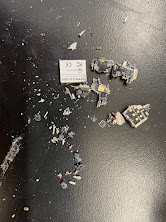 

    
 I used EasyEDA to design and order the PCB. I found the schematics of the H-Bridge driver we are using and simply connected some resistors and capacitors to L9110s. [My full schematic and PCB design files are here](https://oshwlab.com/yaosarayin/drone) and also I included screenshots here of the designa and circuit schematics.

    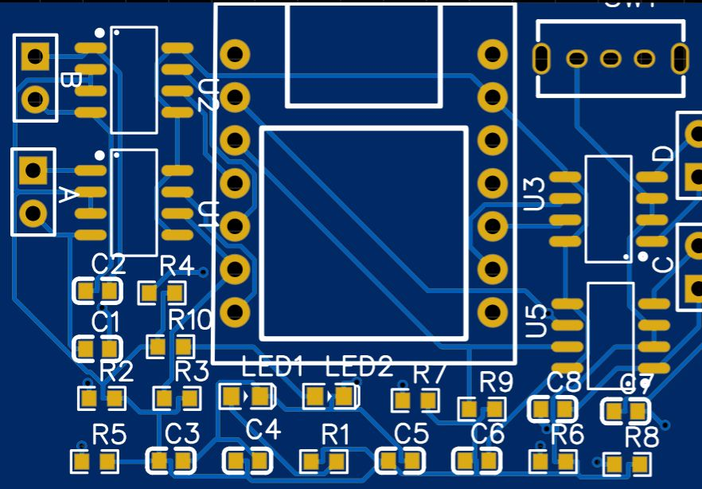 
    

 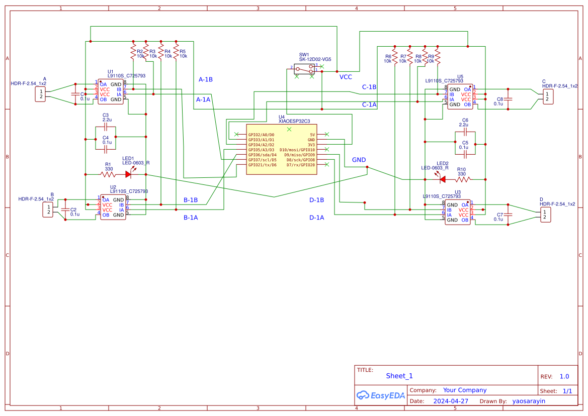 

 

    
 After a week, they arrived! they are cute and purple. This is what they lopok like right after I opened the mail.

    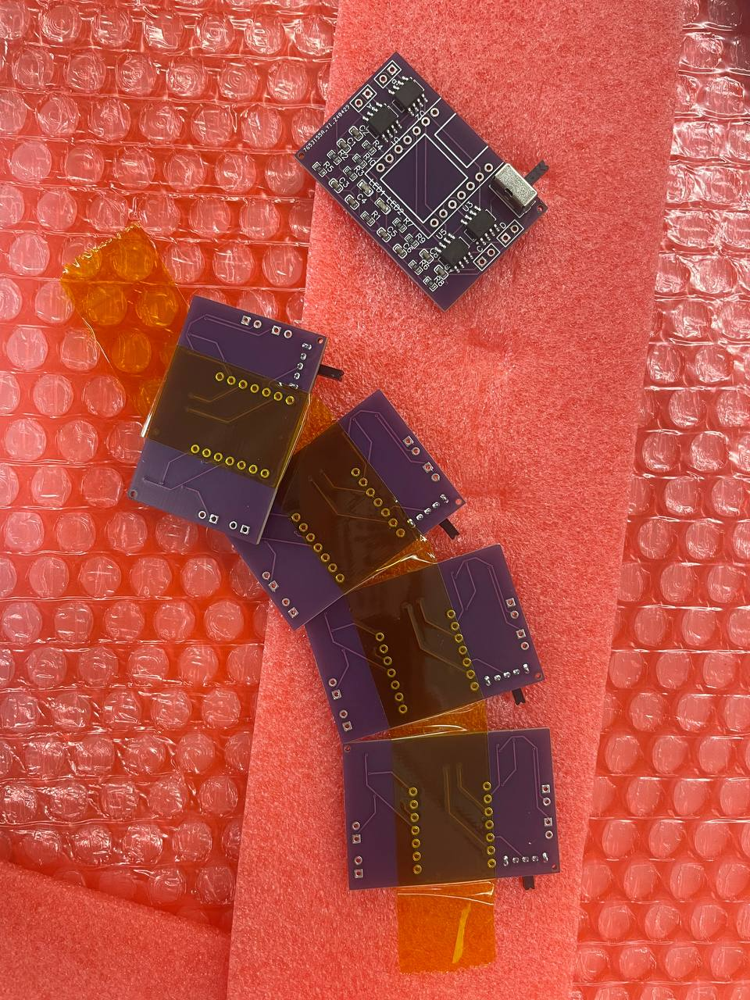 
    

## Major Obsatacle 3: Motors appear to be "possessed by demons" due to current limits

While I was waiting for my PCBs to arrive, I encountered another major obstacle. The motors do not seem to be turning on properly. Instead of running at full speed, they squeak and shake very often. Once in a while two motors would turm on. 

Here is an exerpt from my notes that expressed frustration:

> *May 2, 2024*
>
> *So yesterday I made another board and realized that it was also probably one of my motor drivers were broken? I started with testing one motor driver and it worked and when I connected the second one it stopped working but when I cut off the voltage/ground connecting between the two it worked again….*
>
> *Today I started testing the board with the frame but nothing works properly…. It works sometimes… I don’t know why… VERY WEIRD*
>
> *May 3, 2024*
>
>*Not sure why motors are not working properly 
When touching output pins and gnd with multimeter the motors spin faster
sometimes  they spin sometimes they just do tiny pulses*
>
>*Two possibilities: the Xiao is limited by current / there is something wrong with the board*
>
>*Tried on breadboard, a bit more stable but one motor is still not spinning*

After a lot of frustration, finally, we figured it out by running the motors with a powersupply directly supplying to the power pins of the motor drivers and not using the XIAO to power them. We noticed that, the 3.3V pin can only take 700mA of current, but when all 4 motors are running, they each draw up to 500mA and the total current drawing from the power supply is about 1.6A. This is way too much for the 3.3V pin to handle!!! We now noticed a majoe problem... If I want to run the drone on battery it is virtually impossible at this point because the battery pads on the XIAO is only for the 3.3V pin and the VUSB pin that supplioes 5V and a lot more current cannot access the battery pads. If I directly connect the battery to 5V and ground, we will bypass the voltage regulator circuit that is included in the 3.3V pin that prevents the battery from draining....

It seems like at this pint the best option is to have a cord dangling from the drone... 

Well we are not there yet...

## Making the frame and getting more motors

I lasercut some Acryulic to pressfit the motors and motor gears. Took me a lot of trys to get it right... but they work!

I also bought another pack of the motors of the same size on Amazon that came with small orange propellers. I think these propellers are too small to fly anything but now I have two drones fully assembled!

Here are a SMALL portion of the cardboard tests cuts I did... It was SO HARD to figure out the correct size of hole to use to pressfit the motor because different material also cuts differently in the laser cutter... 

 

    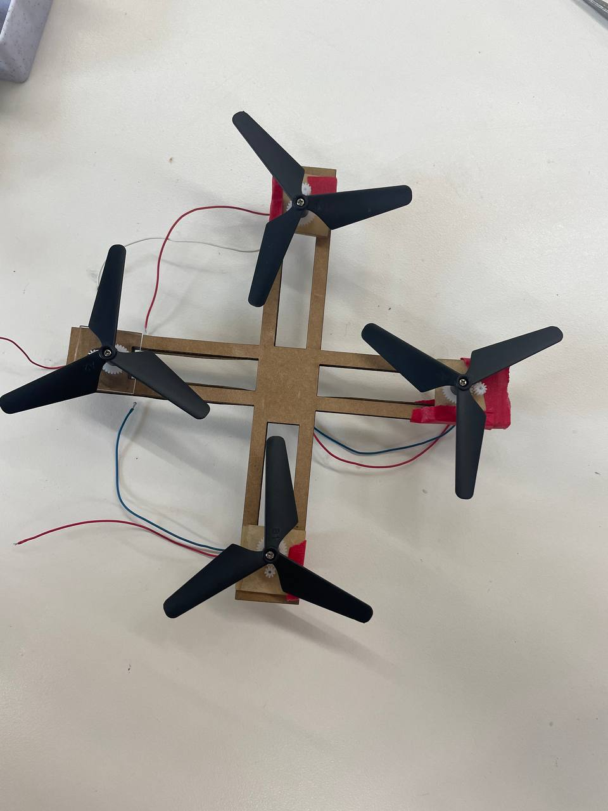 
    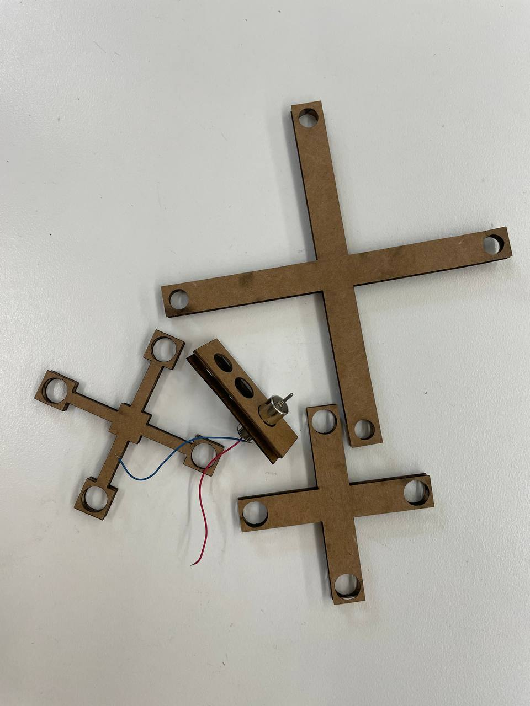 
    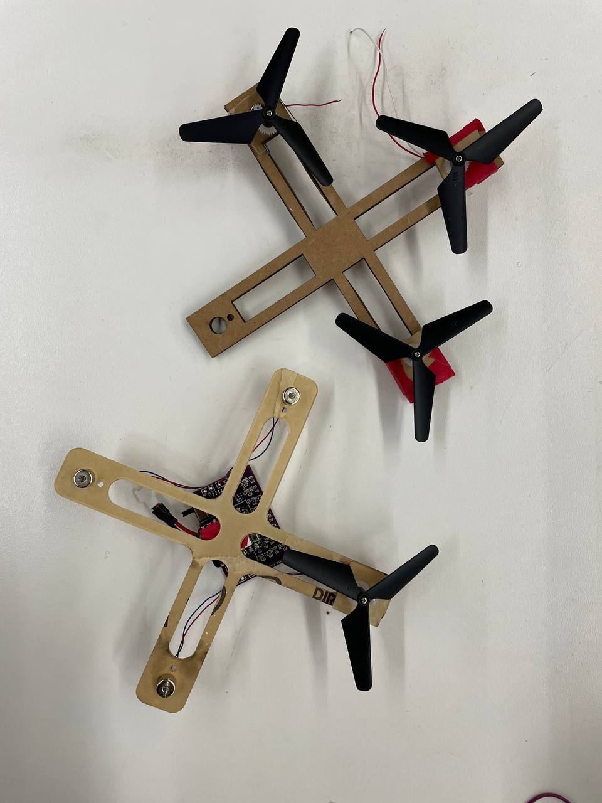 

Some drones versions that I assembled with the hand-made PCB

 

    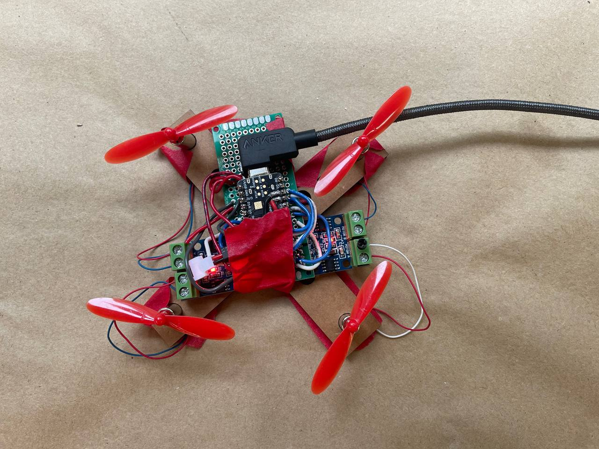 
    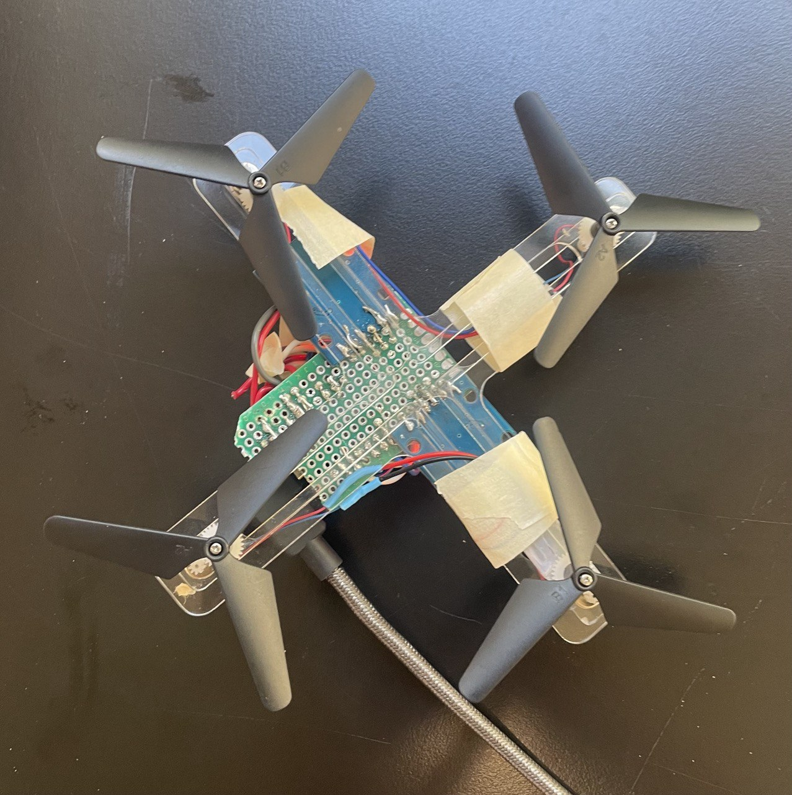 

## Major Obstacle 4: Unpredictable & unstable behavior of the circuit

The problem that we have now I didn't have time to solve before the final project fair and is what is preventing me from having a fully functional drone. 

The issue is that not all 4 motors would turn on all at once consistently.

I was able to turn all 4 motors on INDIVIDUALLY with the PCB we ordered and all together OCCASIONALLY with the hand-made PCB. Here are some videos of when the hand-made board fully worked in turning the motor on and off:

    

        <video controls width="100%">
            <source src="../img/finalProject1/f-16-mov.MOV" type="video/mp4">
        </video>
    

    

        <video controls width="100%">
            <source src="../img/finalProject1/working-1-mov.mp4" type="video/mp4">
        </video>
    

There is also an issue with controlling the motors with L9110. Theorretically, setting both inputs to HIGH would stop the motor, just like setting both to LOW would. If I use 2 HIGHs to turn the motor off ALL FOUR will run nicely for a bit and then slowly stop running, making some squeaky sounds and one time even burned a motor. If I use 2 LOWs to turn to motor off they behave as such shown in the videos below: only 2 of them would turn on at a time... 

Here are some videos of how the motor behaves now, only two of them are able to turn on when asked by ESPNOW to turn on or off. No one yet knows what is going on and I didn't have time to fully debug it before the final project fair. :( Unfortunately I do not yet have fully functional drones. But perhaps one day...

    

        <video controls width="100%">
            <source src="../img/finalProject1/problem-4-1-mov.mp4" type="video/mp4">
        </video>
    

    

        <video controls width="100%">
            <source src="../img/finalProject1/problem-4-1-mov.mp4" type="video/mp4">
        </video>
    

This is what my final drones look like:

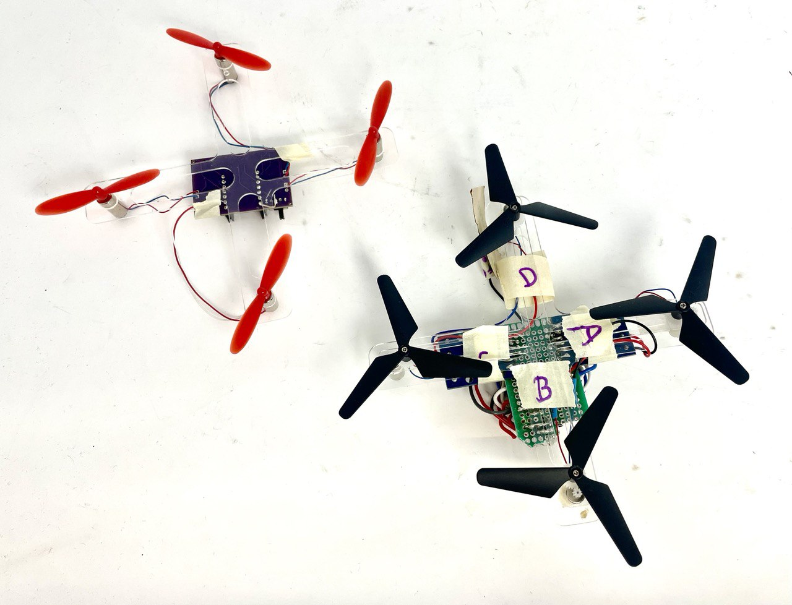 

## Important lessons learned along the way

1. ALWAYS make a MVP first then try to optimize
2. Don’t pursue perfection when you can error correct more easily
3. Don't solder chips and components that may easily have issues directly onto boards! Use header pins
4. Check the schematics and parameters of everything carefully before purchasing components.
5. How to design and order PCBs... and that there is an "auto route" button on EasyEDA...
6. When laser cutting make sure to check whether any lines are duplicated on top of each other in the sketch! This will cause the laser cutter to go over lines multiple times and cause inaccurate dimensions.

## Appendix: Resources I found that maybe useful for future endeavours

- **Huge discussion about ESP32 XIAO’s battery usage:**
  - [Seeed Studio Forum - XIAO ESP32C3 Battery Usage](https://forum.seeedstudio.com/t/xiao-esp32c3-battery-ussage/266185)

- **Resources on L9110S 2-Channel Motor Driver:**
  - [Utmel - L9110S 2-Channel Motor Driver Circuit Pinout and Working](https://www.utmel.com/components/l9110s-2-channel-motor-driver-circuit-pinout-and-how-to-work-video-faq?id=1988)
  - [Arduino Forum - L9110 H-Bridge Speed Control](https://forum.arduino.cc/t/l9110-h-bridge-speed-control/525732/4)

For multicell FPV drones.

**Drone Building Guides and Resources**
- [Dojo for Drones - Build a Drone](https://dojofordrones.com/build-a-drone/)
- [Reddit DIYDrones Community Discussion](https://www.reddit.com/r/diydrones/comments/141u83p/beginner_looking_to_build_a_drone_from_scratch/?rdt=33964)
- [YouTube - GreatScott! Drone Building Tutorial](https://www.youtube.com/watch?v=DeSDjjicGWY&ab_channel=GreatScott%21)
- [Instructables - How to Build a Racing Quadcopter](https://www.instructables.com/How-To-Build-A-Racing-Quadcopter/)
- [Drone Nodes - How to Build a Drone](https://dronenodes.com/how-to-build-a-drone/)
- [Printables by YaoYin - Drone Parts](https://www.printables.com/@YaoYin_1736122/collections/1204186)
- [STLFinder - Joint Box 3D Models](https://www.stlfinder.com/3dmodels/joint-box/?page=2&free=0)
- [Hackaday - ESP32 Quadcopter Project](https://hackaday.io/project/172293-esp32-quadcopter)
- [GitHub - Multiwii ESP32 Port](https://github.com/RomanLut/Multiwii-ESP32-port)

**Components and Parts**
- **Motors:**
  - [BetaFPV - 2204 Brushless Motors](https://betafpv.com/collections/brushless-motors/products/2204-brushless-motors)
- **Batteries:**
  - [BetaFPV - 850mAh 4S 75C Lipo Battery](https://betafpv.com/collections/4s-battery/products/850mah-4s-75c-lipo-battery-2pcs?nopreview)
- **Frame:**
  - [YouTube - DIY Frame from Protoboards](https://www.youtube.com/watch?v=yFBvC_zRiek)
- **Flight Control:**
  - [Ardupilot with Arduino](https://projectsplaner.wordpress.com/post/)
  - [ESP32 Flight Control](https://www.youtube.com/watch?v=KIt8LpW8Ajs)
- **Power Distribution Board:**
  - [YouTube - Power Distribution Board Assembly](https://www.youtube.com/watch?v=dMPgc6_lIuA)
- **Electronic Speed Controller (ESC):**
  - [YouTube - ESC Installation](https://www.youtube.com/watch?v=K9toWUsjgkE)
  - [YouTube - ESC Basics](https://www.youtube.com/watch?v=sau_KQx4EIA)
- **GPS and Remote Control:**
  - [DroneBot Workshop - ESP-NOW](https://dronebotworkshop.com/esp-now/)
  - [Random Nerd Tutorials - ESP-NOW with ESP8266](https://randomnerdtutorials.com/esp-now-esp8266-nodemcu-arduino-ide/)
  - [YouTube - ESPnow RC Car Joystick Remote Control](https://www.youtube.com/watch?v=uNXP95vOytw)
- **Controller:**
  - [YouTube - ESP32 Drone Controller](https://www.youtube.com/watch?v=Lvfb9cy5px8)
  - [ESP-Drone Documentation](https://docs.espressif.com/_/downloads/espressif-esp-drone/en/latest/pdf/)
  - [YouTube - ESPNOW Wireless Transmitter Receiver](https://www.youtube.com/watch?v=PeFdBvRe5WY)

**Additional Hardware Components**
- [AliExpress - 1806 Brushless Motors](https://s.click.aliexpress.com/e/_DEL...)
- [AliExpress - Emax 12A Brushless ESC](https://s.click.aliexpress.com/e/_DBP...)
- [AliExpress - PCB Boards](https://s.click.aliexpress.com/e/_DEq...)
- [AliExpress - Standoff Spacer](https://s.click.aliexpress.com/e/_DEY...)
- [AliExpress - 4045 Propeller](https://s.click.aliexpress.com/e/_DEI...)
- [AliExpress - 3S Lipo (800-1300mah)](https://s.click.aliexpress.com/e/_DCA...)
- [AliExpress - 2mm Gold Connectors](https://s.click.aliexpress.com/e/_DE7...)
- [AliExpress - T-Plug Connector & Cable (Male)](https://s.click.aliexpress.com/e/_Dl9...)
- [AliExpress - 2 Pin JST & Cable](https://s.click.aliexpress.com/e/_DmR

