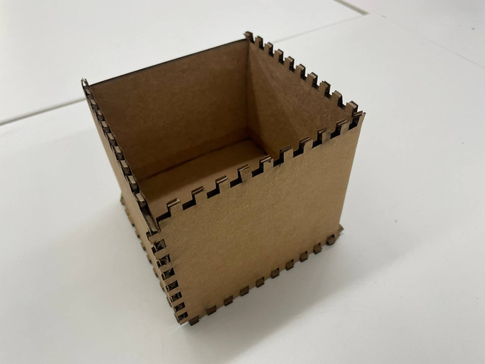
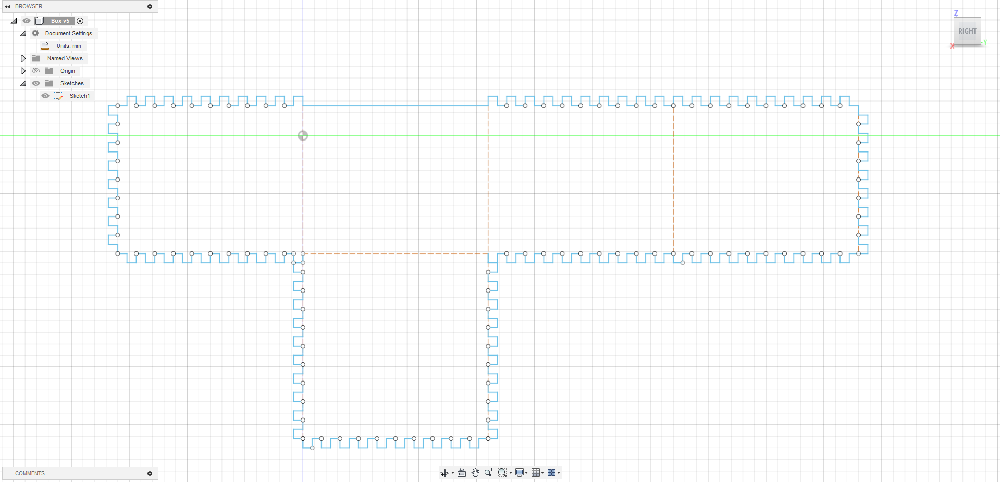
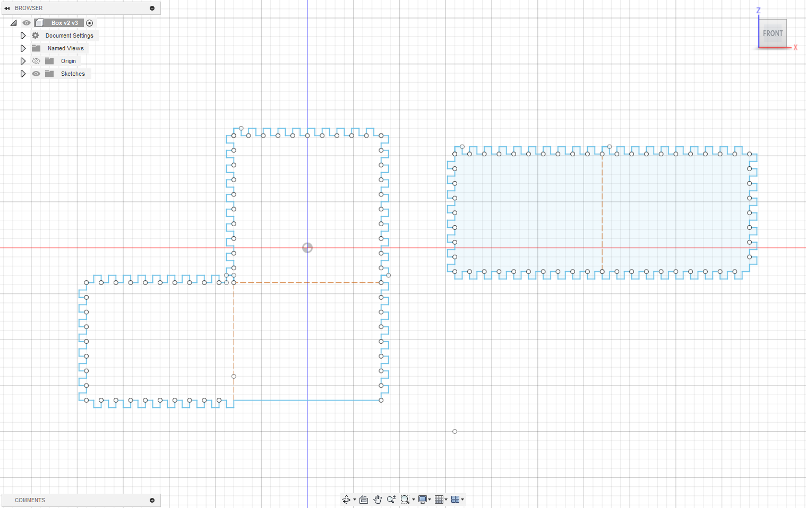
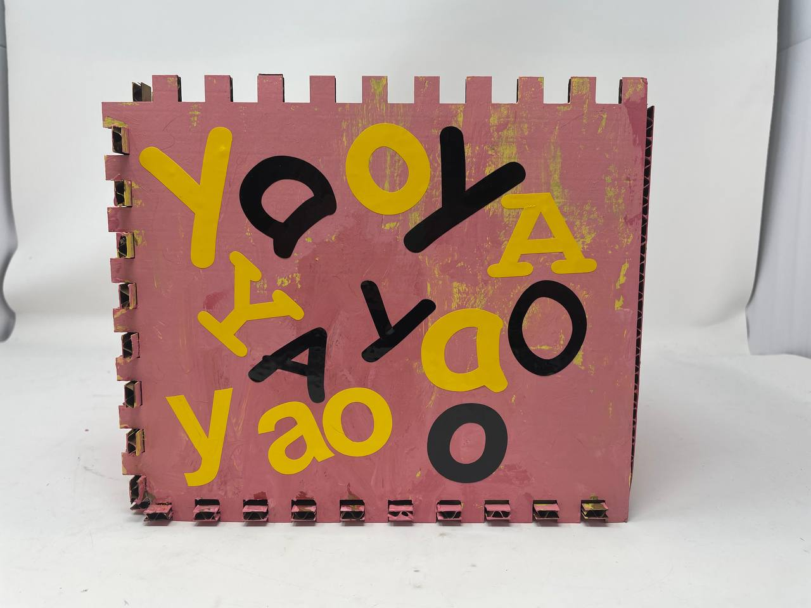
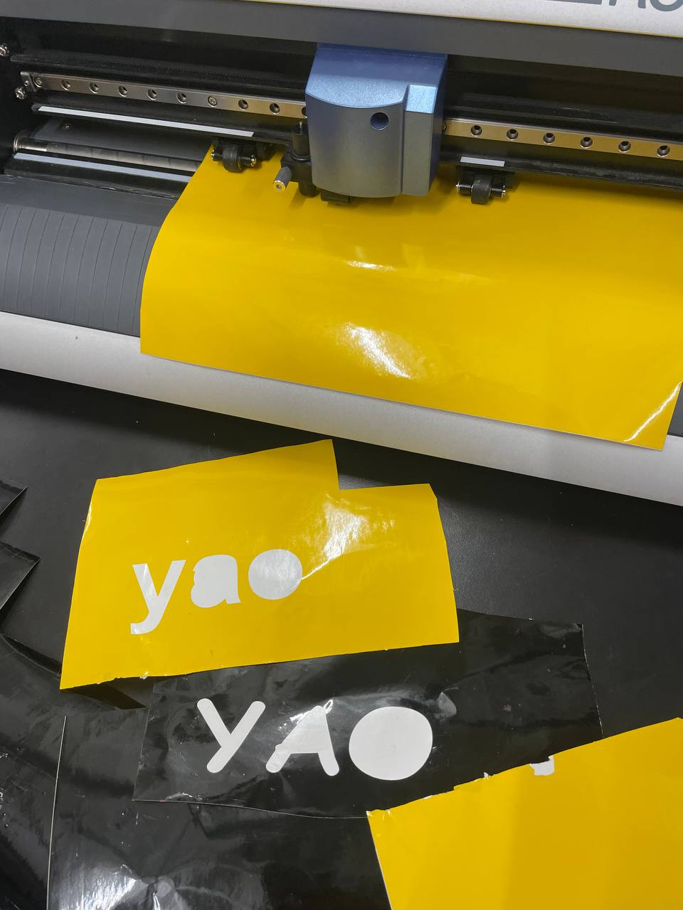
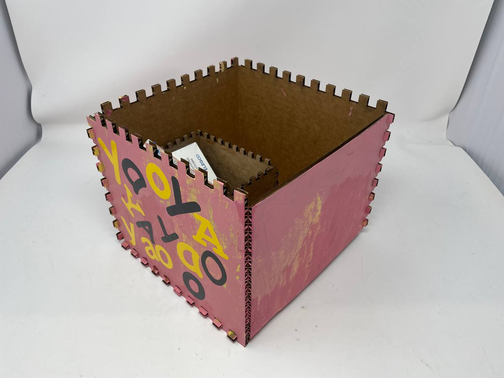
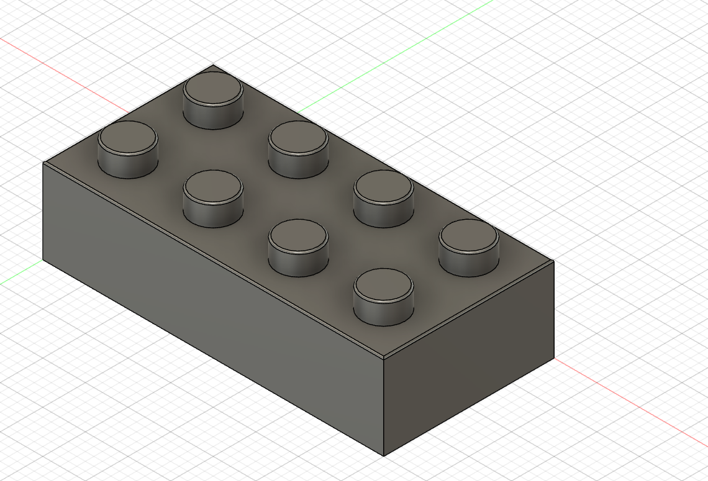
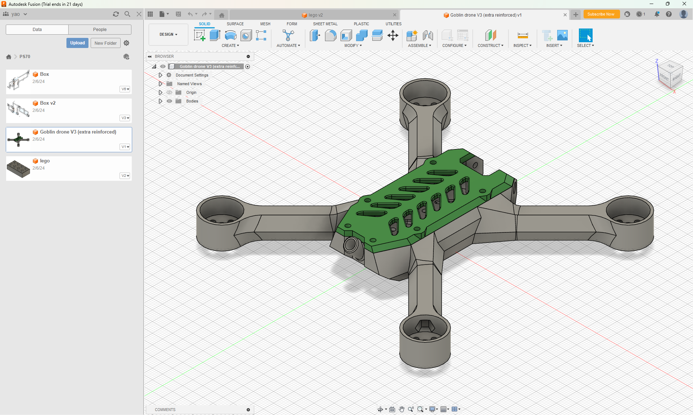

# Lasercutting!
I made a small box! After many trials and errors with fusion 360...

Here is a screenshot of my design file. I printed it to be way smaller than the design says. I realized that if I make the size that I want to make I would have to modify the design because it would not fit within the laser cutter...

 Later on I made a larger box after modifying the original design into two parts. Because I realized that the laser cutter is not big enough to print the whole thing at once. I learned that if you copy objects from Fusion 360 to a new design file all the parameters will be gone. So I had to manually scale it down in Rhino. I just dragged the other part that I am not cutting outside of the canvas in Rhino, to ensure that both parts are scaled in the same way. I then decided to paint it using the acrylic colors in the cupboard. :) 

Then I wanted to procrastinate doing my other works... So I decided to take upon the vinyl cutter and actually learn how to use it. I always forgot to pull the lever up to load the paper. I also spent a long time figuring out why it says "bad position" all the time -- it's because the two little wheels must be placed inside the white tapes. I ended up printing a lot of stickers that says my nae on it... I decorated my box with all the stickers I cut.

Final product of my big box with my small box inside... Later on I want to cut a plastic transparent lid for it. But I may have to redesign the fusion file and print the whole thing again because I don't think I will be able to replicate the manual scaling...

For the Fusion tutorial part, I made a lego block following a Youtube tutorial. It is interesting to learn how to use the 3D features and I finally understood what "Sketch" means.

I was also exploring files online for my final project (transportation drone) and played around with some of them. I learned how to import meshes and STEP files into Fusion 360. The next goal will be to make/modify some propellers to be able to fit on top of the drone body.

