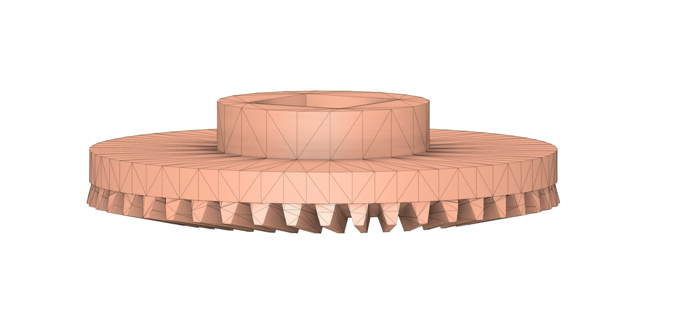
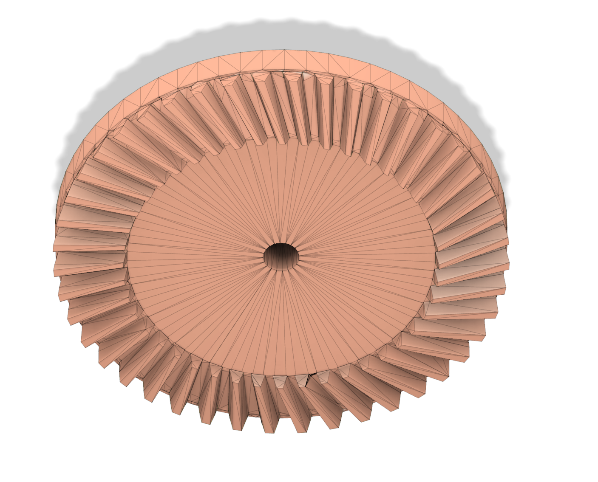
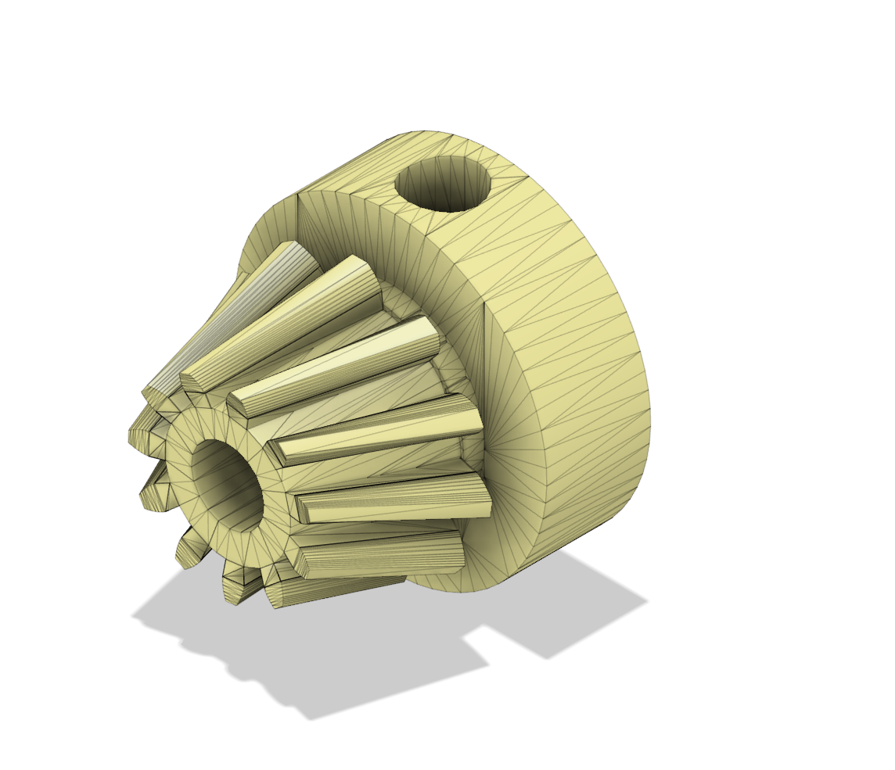
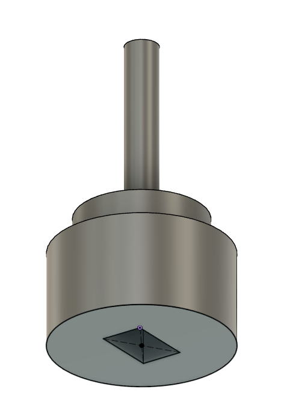
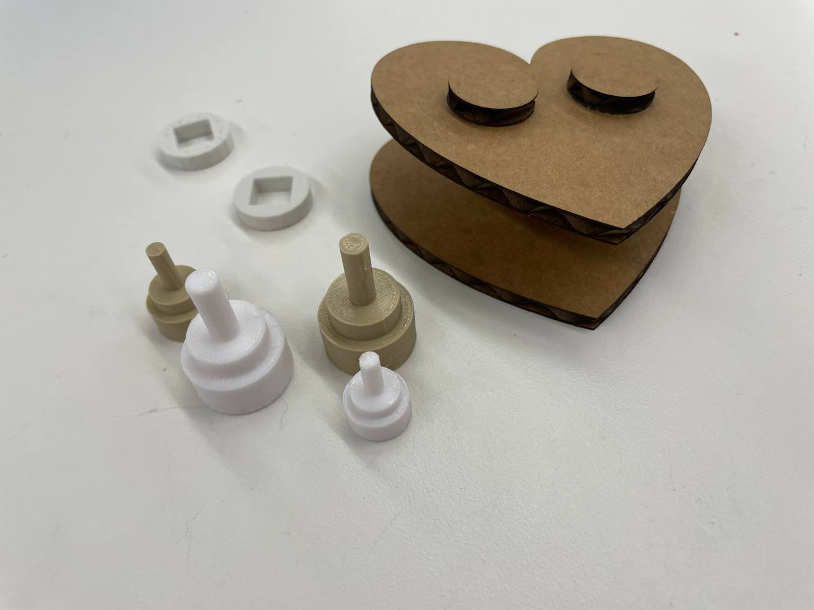
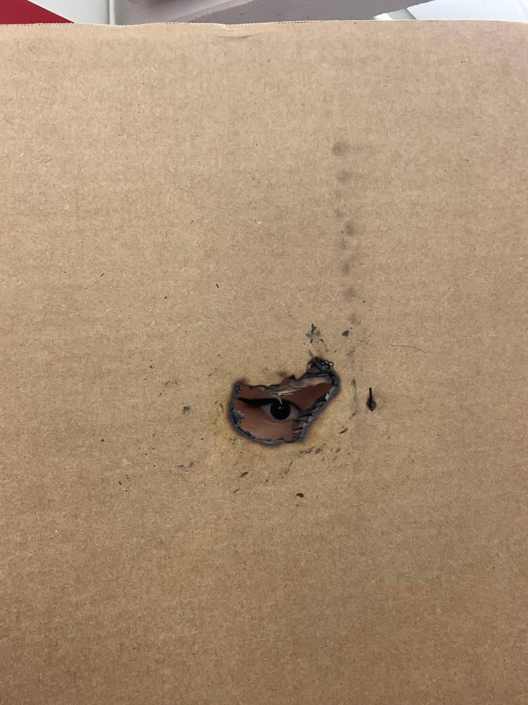
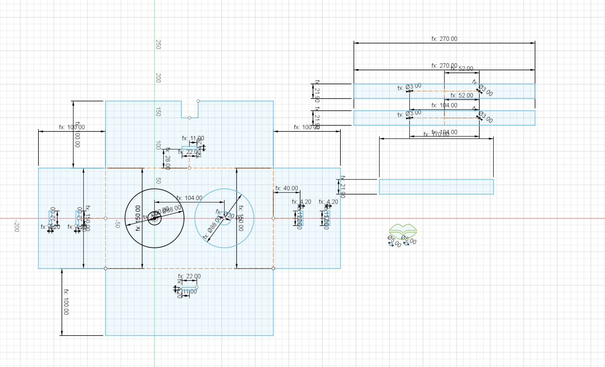
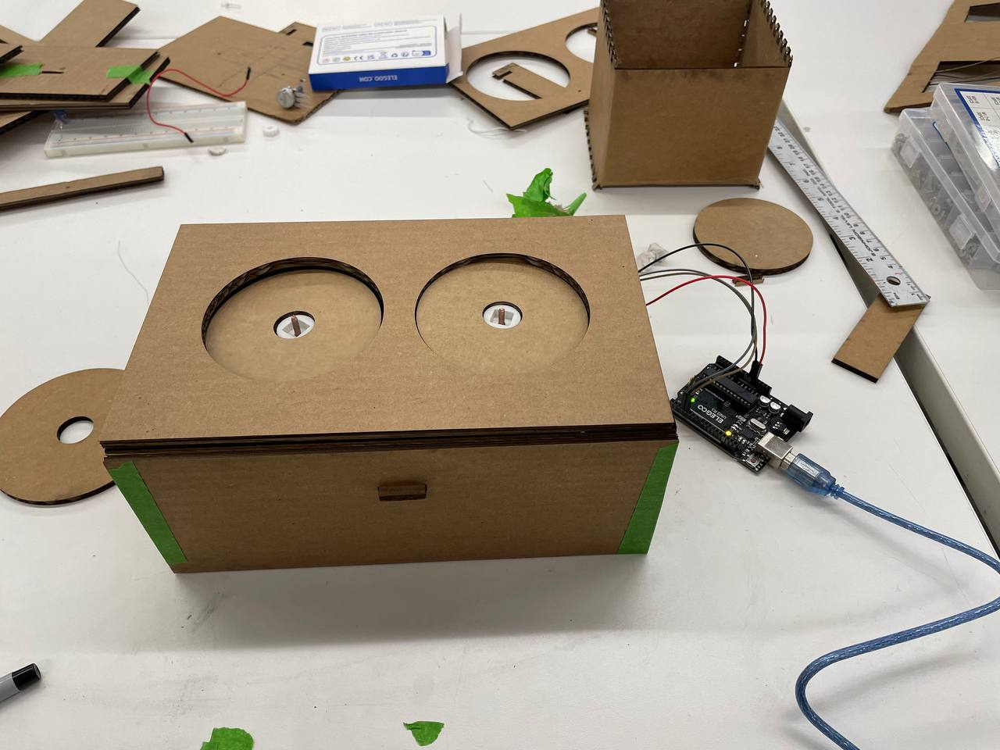

# Handtools and Fabrication

This week we learned about how to use the bandsaw, scrollsaw, and various handsaws to cut wood and metal. We also learned how to use the drill press and hole tap. For lab, we made some easy mechanical systems for moving stuff. We learned about motors and gears.

## Some notes about motors and gears

1. Use gears to make the motor spin slower or faster; if just increase or decrease the voltage it will be very inefficient.
2. When you are buying a motor you are basically paying for a gearbox. Makes it have a heavier load.
3. Want gears to exchange speed for torque --> exchange faster speeds for lower speeds and in the process give you torque.

## Assignment

I didn't really know what to make at first but for some reason, I really wanted to make some gears that are perpendicular to each other. I then thought about one of my previous final project ideas which is to make a small DJ turntable. So this is what I did.

I first printed the BEVEL GEARS that I wanted - these are gears that go perpendicular to each other. I want to use the yellow motor we used in class and make two "disks" turn at the same time.

These are the 3D models I used. I found them online.

    
    
    

I designed a connector myself that will go between the small gear and the motor:

    
    

        I initially had some troubles with the 3D printer. I forgot to put on supports the first two times I attempted to print the big gear. I also FORGOT TO ZERO THE CALIPERS and thought the Prusa software was printing wrong dimensions but it was my measurement error the whole time...
    

Here are some of the failed components - I struggled to get the connector's dimensions just right... It is a great lesson! ALWAYS ZERO THE CALIPERS! I made a heart out of some failed parts because yesterday was Valentine's day. :)
I also burnt a hole once laser cutting because I forgot to change the material settings...

    
    

    
        Then, I have to design the 2D components. I first drew out my idea and then used the laser cutter to cut the box and the "disks" that will spin. This also finally succeeded with many trials and errors... It is very hard to think about everything that you need on the first try! The final touch I added was a little hole on the side for the wires of the motor to go through and connect to the Arduino / MC and power.

## Final Product

Here is a video of what the gears look like inside! The connectors I printed ended up being multi-colored (pink and grey) because we ran out of filaments halfway through the print. :)

<video controls>
  <source src="../img/week3/3-1-v.MOV" type="video/mp4">
</video>

Here is what it looks like when packaged.

<video controls width="50%">
  <source src="../img/week3/3-2-v.MOV" type="video/mp4">
</video>

I want to make a final final version with different materials. Possibly plastic. I also want to decorate it.

Next week I want to make a speaker that connects to it and can play music at the same time. :)
