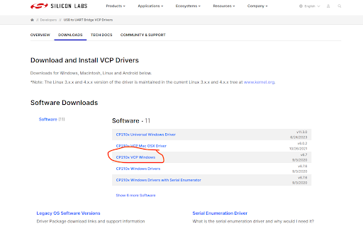

# Microcontroller Programming!

So this week my goal was to make somethig ~ musical ~ that will go with my little motor-controlled DJ table.

Initially I just wanted to control a speaker with Arduino and play some pre-downloaded music. Then Bobby suggested that I use the version o ESP32 that has built in WIFi and Bluetooth controls!

For a while I literally was failing to connect to the board with my Windows computer and getting this error:

```
A fatal error occurred: Failed to connect to ESP32: No serial data received.
```

Fixed it after downloading the correct VCP Driver! I was following the instructions <a href="https://randomnerdtutorials.com/installing-the-esp32-board-in-arduino-ide-windows-instructions/">ON THIS WEBSITE</a> to set up all the neessary libraries for ESP32 on the Arduino, but it wasn't specifying what VCP driver to use. I am using a 64bit Lenovo Yoga running Windows 11. After some trial and errors we found that the one circled here is the correct driver.



Then, I followed instructions on <a href="https://github.com/pschatzmann/ESP32-A2DP">THIS GITHUB OVER HERE</a> and <a href="https://www.youtube.com/watch?v=24pk28oqVQI">THIS YOUTUBE VIDEO</a> and successfully connected my phone's bluetooth to play music! The key is just to connect the wires to the correct pins. :)

The next step is to sync some LED lights with the music. Originally I was planning on syncing it to the frequency of the sounds, but after some research it seems a bit too involved, as it requires doing fourier transforms and stuff. I finally just decided to sync it to the amplitute of the sound, which ended up working relatively well since we can seperate the sounds of the bass etc. gernerally by volume. But in the future I definitely will try to do some discrete fourier transforms and sync it to the frequency.

Here is the final product syncing to the amplitude of the music!

<video controls>
  <source src="../img/week4/4-1-v.MOV" type="video/mp4">
</video>

Here is my Arduino code:

```C
    #include "BluetoothA2DPSink.h"

    #define GREEN_LED 14 // Use GPIO 14 as LED pin
    #define WHITE_LED 13// Use GPIO 14 as LED pin


    BluetoothA2DPSink a2dp_sink;

    void setup() {
        Serial.begin(115200);
        pinMode(GREEN_LED, OUTPUT); // Initialize the LED pin as an output
        pinMode(WHITE_LED, OUTPUT); // Initialize the LED pin as an output

        i2s_pin_config_t my_pin_config = {
            .mck_io_num = I2S_PIN_NO_CHANGE,    
            .bck_io_num = 27,
            .ws_io_num = 26,
            .data_out_num = 25,
            .data_in_num = I2S_PIN_NO_CHANGE
        };
        a2dp_sink.set_pin_config(my_pin_config);
        a2dp_sink.start("djbox");

        // In the setup function:
        a2dp_sink.set_stream_reader(audio_data_callback);


    }

    void loop() {
    }

    volatile int16_t lastVolume = 0;

    void audio_data_callback(const uint8_t *data, uint32_t len) {
    //   int16_t *samples = (int16_t*) data;
    //   Serial.println(*samples);

        if (len >= 2048) { // Adjust based on your data packet size
            int32_t sum = 0;
            for (int i = 0; i < 1024; i += 4) { // Skip every other sample for simplicity
                int16_t sample = (int16_t)((data[i + 1] << 8) | data[i]);
                sum += abs(sample);
            }
            lastVolume = sum / 256; // Simplify by averaging volume
            // Serial.println(lastVolume);
            // Simple condition to turn LED on/off based on simulated volume
        if(lastVolume > 5000) {
            Serial.println("light!");
            digitalWrite(GREEN_LED, HIGH); // Turn LED on
        } else if (lastVolume > 3000){
            digitalWrite(WHITE_LED, HIGH); // Turn LED on
        } else {
            digitalWrite(GREEN_LED, LOW); // Turn LED off
            digitalWrite(WHITE_LED, LOW); // Turn LED off
        }

        }
    }

```
