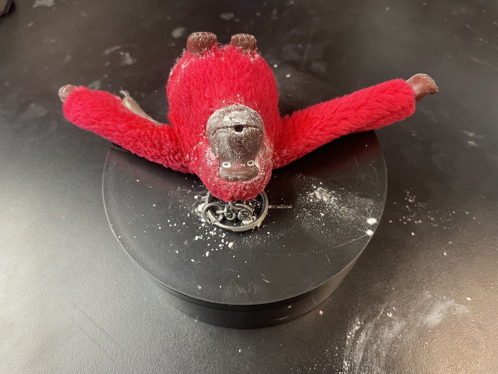
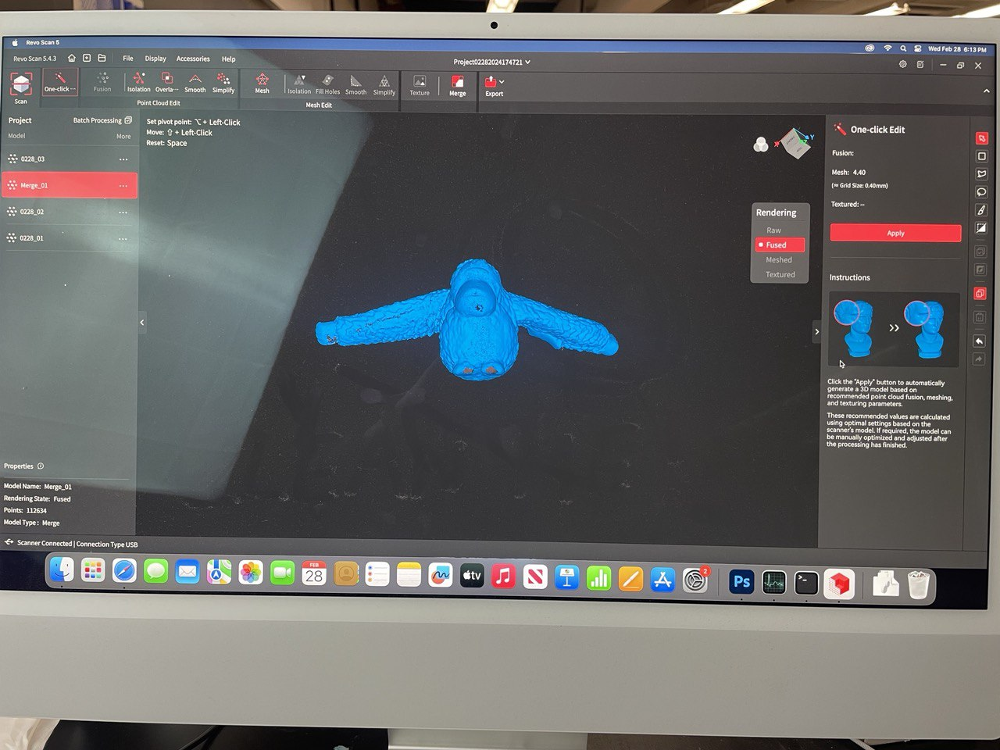
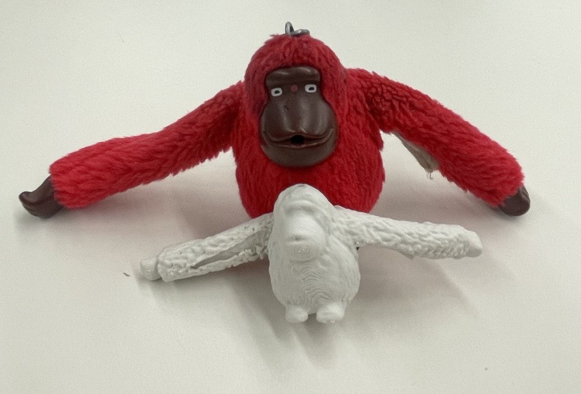
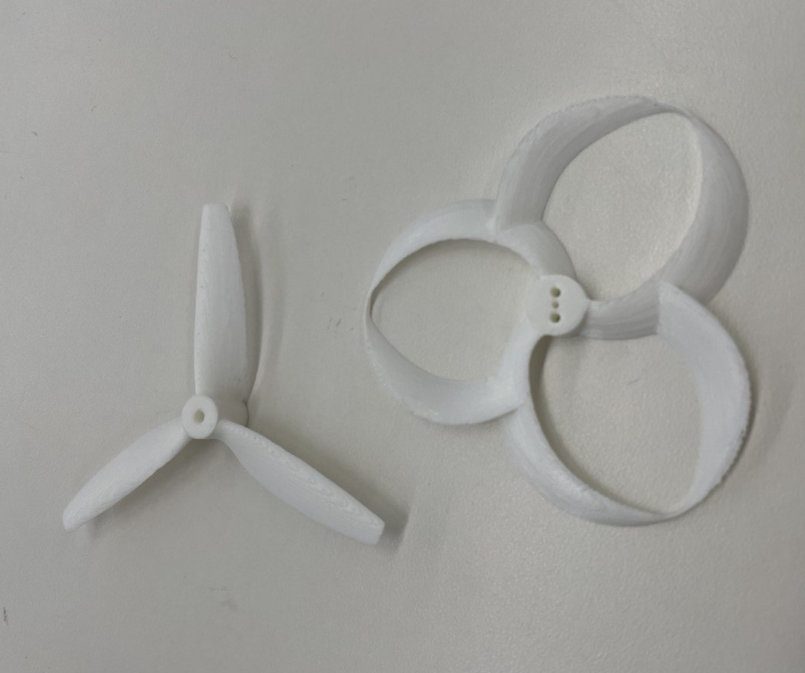
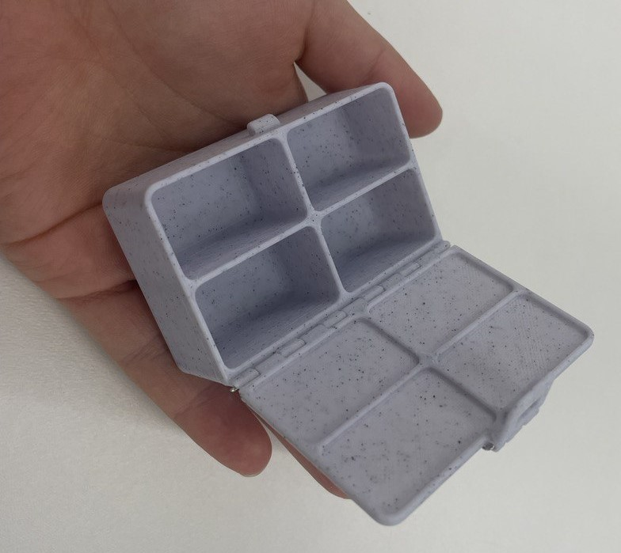
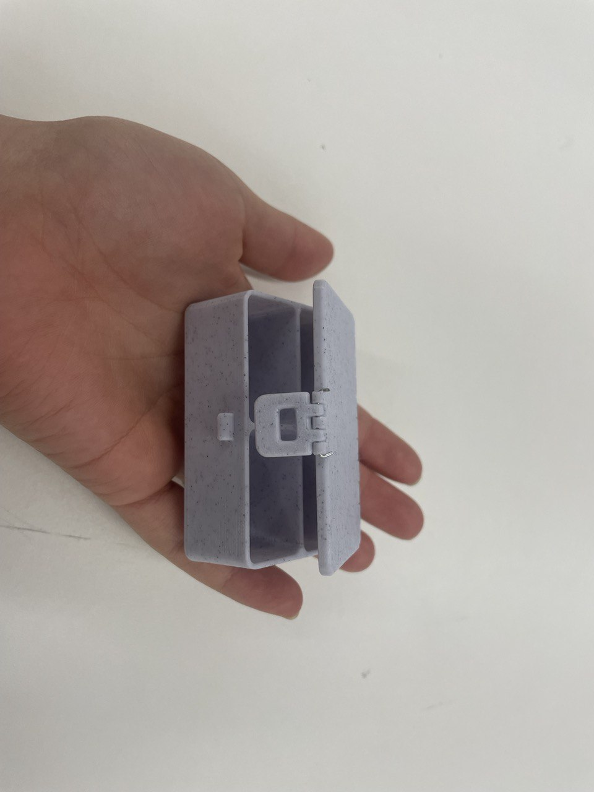

# 3D Design and Printing

For this week I basically just printed a bunch of random stuff. I think the largest learning curve is learning how to use the scanner... I did some digging and really couldn't find any good 3D scanning APP on your phone that I can use. So I just used the camera in the lab.

An interesting thing is that the camera is really bad at scanning dark colors. I wanted to scan this monkey key chain on my backpack and just couldn't get the face and arms of the monkey... After powering it with baking soda and doing 3 seperate scans and, combining them, and patching them we finally got it. The final print result is not so horrible!

 
 
 

Second set of prints I did were some propeller tests for my final project. They went really well! I would probably try to increase the infill but I am happy with how the supports came off etc.
 

Final set of prints are some boxes for organizing my tiny components! After 2 failures I finally managed to print this box that I can hold in my hand and put a wire through the joints to connect the lid and the body. Previous attempts either failed to open or have too much support that I cannot take out.
 
 
