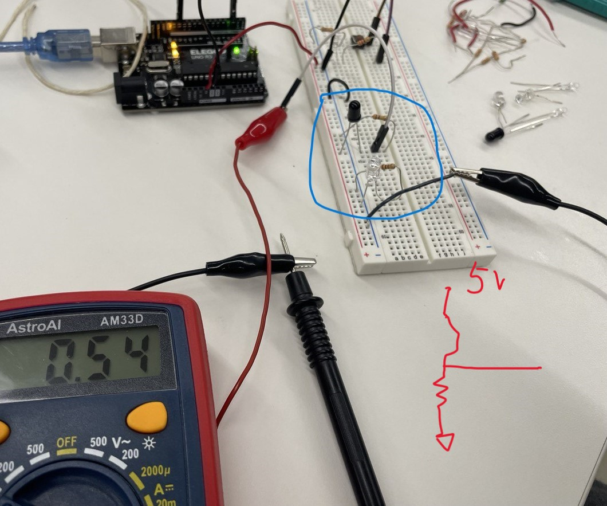
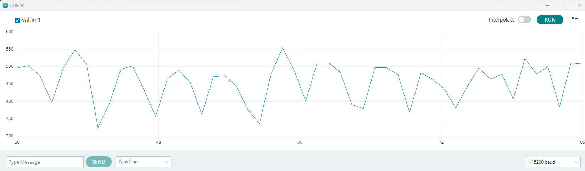
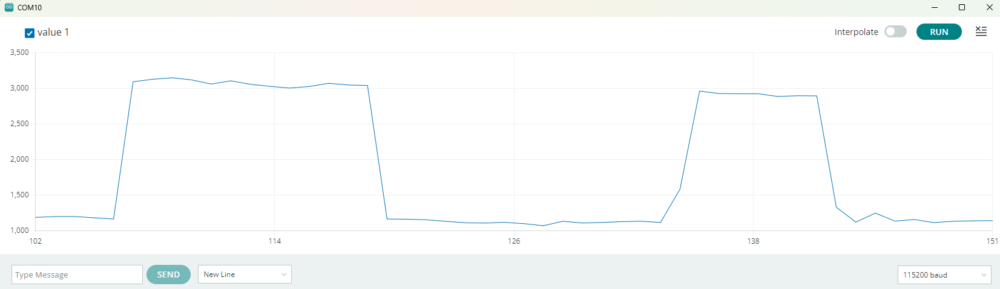

# Electronic Input System

Okay so I got behind on work and ended up have to catch up on week 6-7's assignments together. I ended up doing Week 7's assignment first and making the LED lights work. So for this asignment's goal I want to combine the input system and control some outputs from ESP32. NOTE, when I started doing the second half of this I also had to 

It was a lot more work than anticipated for me to get my silly little IR transister to work with an IR LED... I was probably also just not in my right mind that day... ANYWAYS, I was basically just trying to measure the voltage generated by the voltage divider formed by the phototrasnsiter and a certain resistor. I started out using 100-200 Ohm resisters and then 10 kOhm resisters but I kept not seeing any voltage across the resistor... Finally after asking for Nathan's help and changed to 100 kOhm resistor, I started seeing voltage on the voltmeter... Oh well.

I need to review how the phototransistor works physically and why we need such large of a resistor value.

 

Okay so my original plan was to build a remote control for my LED strip using IR LEDs and transisters. But I got a bit mad about the transister and also I wanted to try something where I do know what resistor values to use as of now... SO I decided to try a photoresistor circuit - this can probably make a lil touch-controlled lights system.

I measured the resistance across the photo resistor under just ~ambient~ light in the lab: around 4.6 kOhn. When it is covered my finger, the resistance across the two legs is about 30 kOhm. Great! This means that I can choose a 10k resistor to connect to 5V, and the analog voltage output of the divider would be 1.7V in ambient classroom light and 3.7V under finger. I can input this value to the ESP32 and control the LED lights accordingly!

Then, after some digging online (https://randomnerdtutorials.com/esp32-adc-analog-read-arduino-ide/) I realized that for an ESP32 the analog inputs must be between 0 and 3.3V! Need to change my setup accordingly... So when the 10K resistor is connected to the 3.3 V supply, the voltage output of the divider goes between 1.1V at ambient room light and 2.5V when covered with finger.

We need to carefully choose the pins that support ADC input. GPIO 4 is one of them.

After connecting the photoresistor to the ESP32 I noticed that due to the extra wire the resistance measured on the voltmeter somehow changed

Running into wierd upload issue again... See my rant in week 7's notes. I figured out that I have to put the board in BOOT mode by connecting GPIO 0 to ground when uploading. But even when I successfully upload it once the next time doesn't seem to always work... very frustrating. I figured out that I really just need to unplug and replug the board everytime before uploading and make sure to connect GPIO0 to GND during upload...

Finally got my code uploaded. Ran into issues where when I include functions to turn the LED on the serial monitor doesn't output anything... When it does show the analogRead values from the photoresistor, the values seems to just wobble around and not correlate with how much light it is getting... 

 

After a hot minute and asking Bobby I realized that this is not because the LED interferes with the serial monitor, but rather that my loop just takes along time to run because I am running all the light sequences...So the sensor reading has to wait for all the lights to finish running then read and print again. And the oscillating values is just cuz I LITERALLY CONNECTED TO THE WRONG PIN...After correcting these, it works! Silly me!
 
 

In the image above, the two plateaus are the sensor value with ambient light (raw value ~ 1120) and the sensor value when the resistor is covered by my finger (raw value ~ 3100). The voltages as read from my voltmeter is 1.1V (ambient light) and 2.5V (finger covered). Now we can devise a formula to convert voltage to raw ADC value and hopefully control the lights based on the sensor values!

AAAAAND it's working! Yay! Now my lights varies from red to green based on the sensor value!!

<video controls>
  <source src="../img/week6/6-1-MOV.mp4" type="video/mp4">
</video>

The problem now is how to make it pretty and integrate it with my little DJ box and have music playing that sync with the lights :) But this board and the connections to the LED are all super finicky and I might have accidentally broke the lights while playing with it more... Need to make some better connectors...

