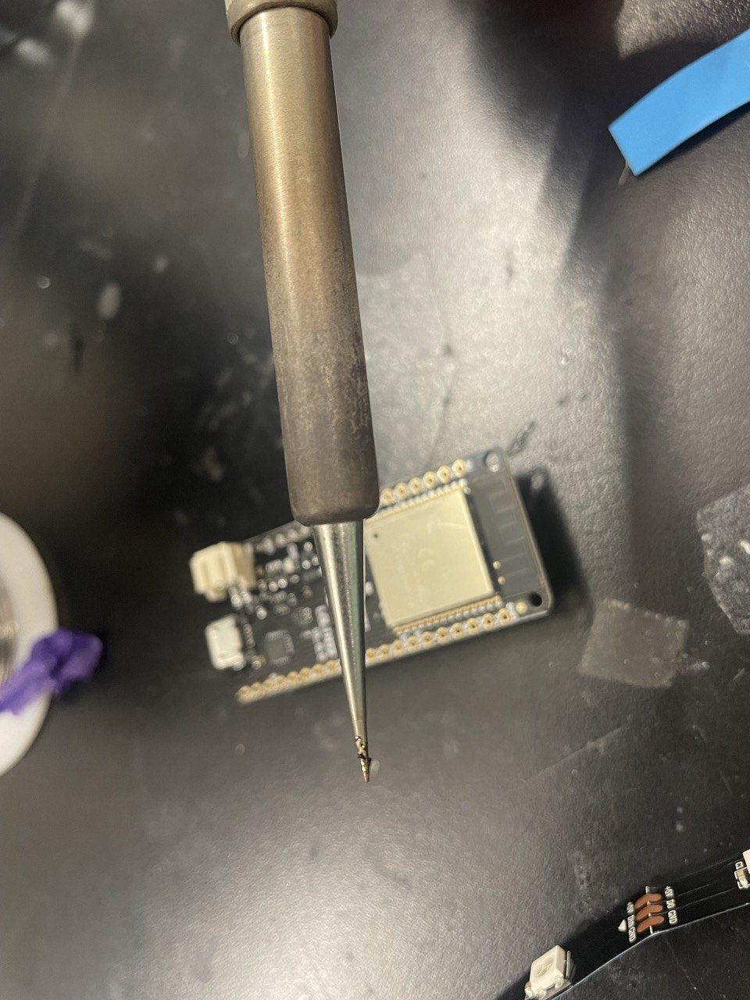
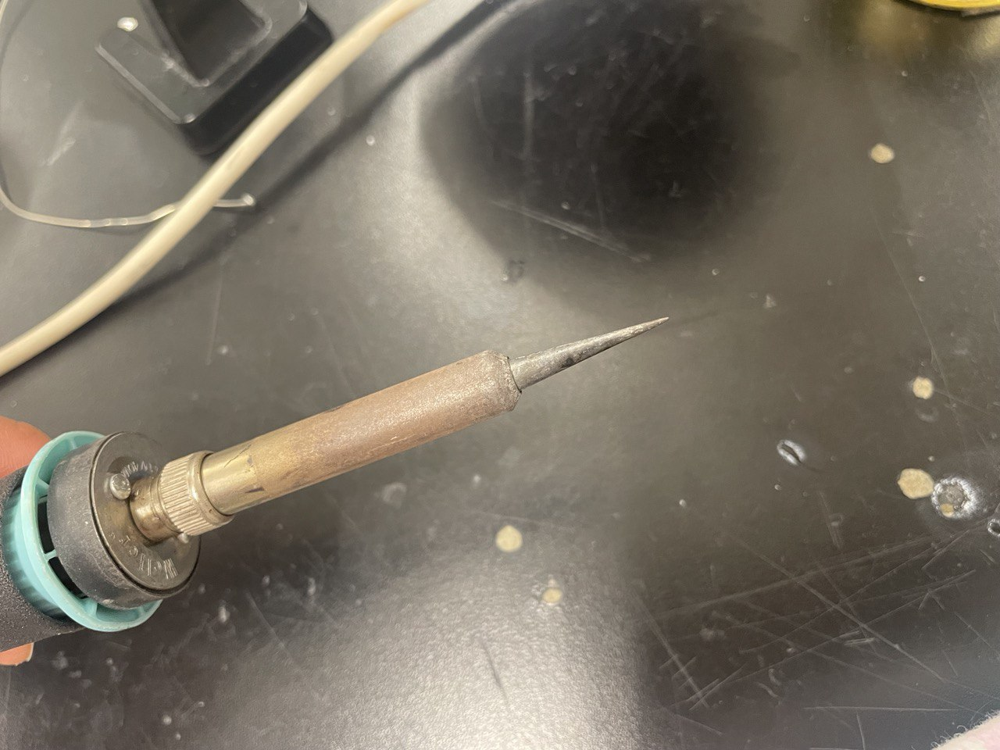
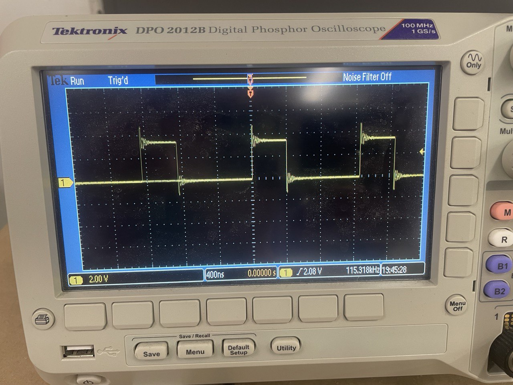
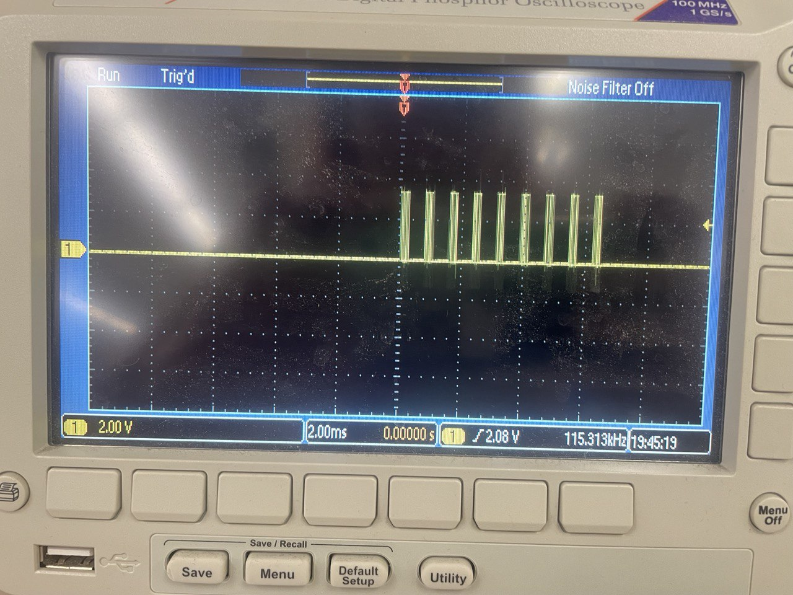
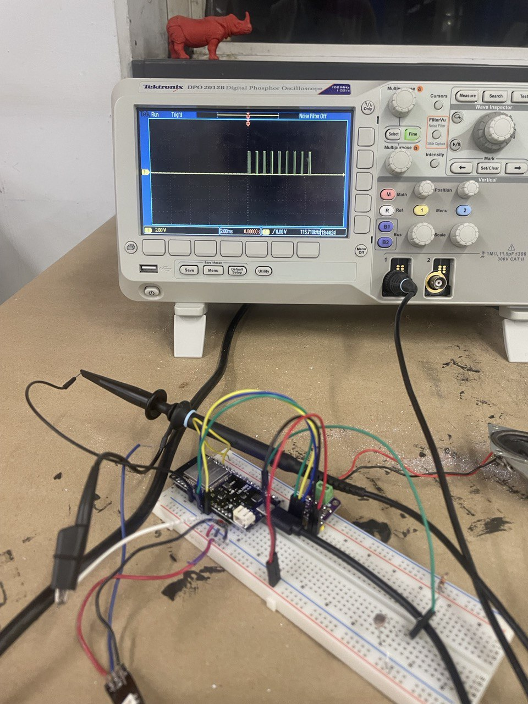
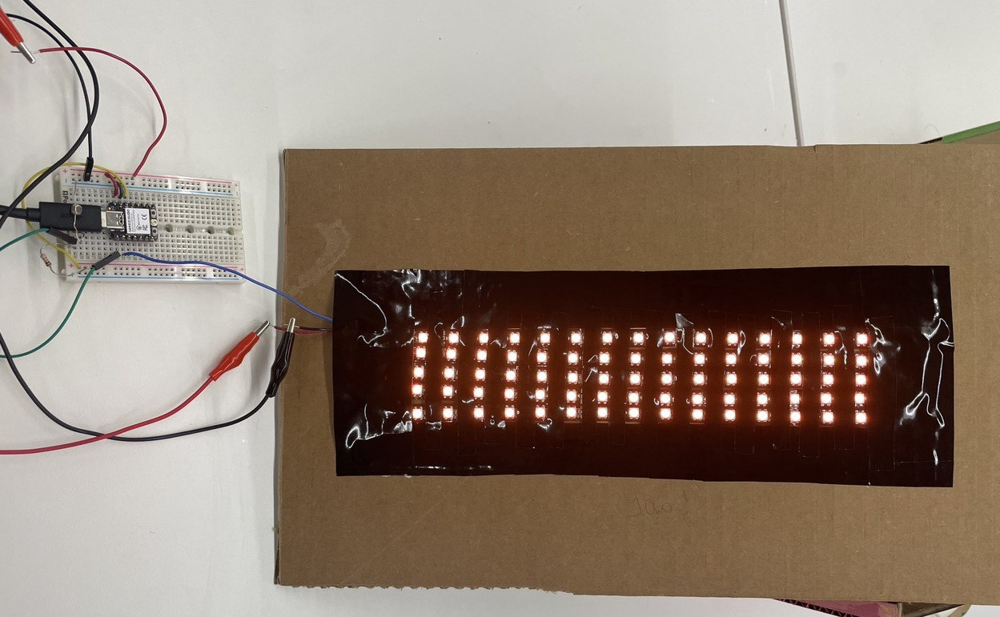

# Electronic Output Devices

I did week 6 and 7 pretty much together. You can see my final product of LED output with photoresister input on the week 6 page.

The hardest part this week was literally trying to solder the fricking wires onto the LED strips. After 2 days of failure I decided to SWITCH SOLDERING STATIONS and wow, apparently I am not the one who's bad at soldering, it's the iron...

And because I was being a bit stupid and decided to try the wires on the other end of the strip that came from the manufacturer, I accidentally FRIED my ESP32 and had to get another one. :( Now we have a WEMOS LOLIN32 board, whose inout is slightly different

Lessons for soldering:
- Use the SHINY irons!
- Always solder pins onto boards with them positioned on a beardboard. Otherwise the pins may be wobbly or just slanted...
 

GOOD SOLDERING IRON (UP).

 

BAD SOLDERING IRON (UP).

I realized that this new board is very bad and I don't like it at all (see more details on week 6's page) I ran into some prolems with connecting to the board... 

First error: A fatal error occurred: Failed to connect to ESP32: Wrong boot mode detected (0x13)! The chip needs to be in download mode.

Second error: A fatal error occurred: Failed to connect to ESP32: No serial data received.

Solved it after downloading another CH340 driver from here: https://www.wemos.cc/en/latest/ch340_driver.html AND connecting GPIO pin 0 to ground to manually set the board into BOOT mode (see this Github issue thread here: https://github.com/espressif/arduino-esp32/issues/333), since this board only has a reset button and not a boot button. I also read online that you need to make sure GPIO2 pin is also grounded during upload, which I double checked that it is. 

Running into weird problem where the LED only shines after I successfully upload the code once AND THEN fail to upload the code another time... I suspect that it is probbaly because I need to get rid of the BOOT jumper cable right after upload / during the upload? Unsure about this mystery still... I finally figured out a "reliable" way to upload, which is to disconnect and reconnet the micro USB everytime before uploading, ground GPIO0, press upload, and then unground it right after it starts "writing." 

Crazy that I have to do that just to upload... The board is also very very finicky where sometimes the LED strip would work and sometimes not... I just have to turn it on anf off a couple of times... I need a better board!

But anyways, I looked at the output to the LED pin when I was trying to debug the board too. It seems to be working in these pictures but sometimes the LED strip still doesn't light up reliably... I need to debug more / try another strip.

 
Waveform zoomed all the way in of pin 33 (output pin that controls the arduino)

 
Waveform "packets"

 
Setup when debugging with oscillascope.

Also I realized that I DID break the original LED strip I was using.  Luckily I am an expert at soldering these things now and I ended up making A LOT of them. Was not planning to do this but it was super fun. I think I will have a little side project of making an LED display with light sensors and custom letters etc. Here is what it looks like now:

 
<video controls>
  <source src="../img/week7/7-1-MOV.MOV" type="video/mp4">
</video>
