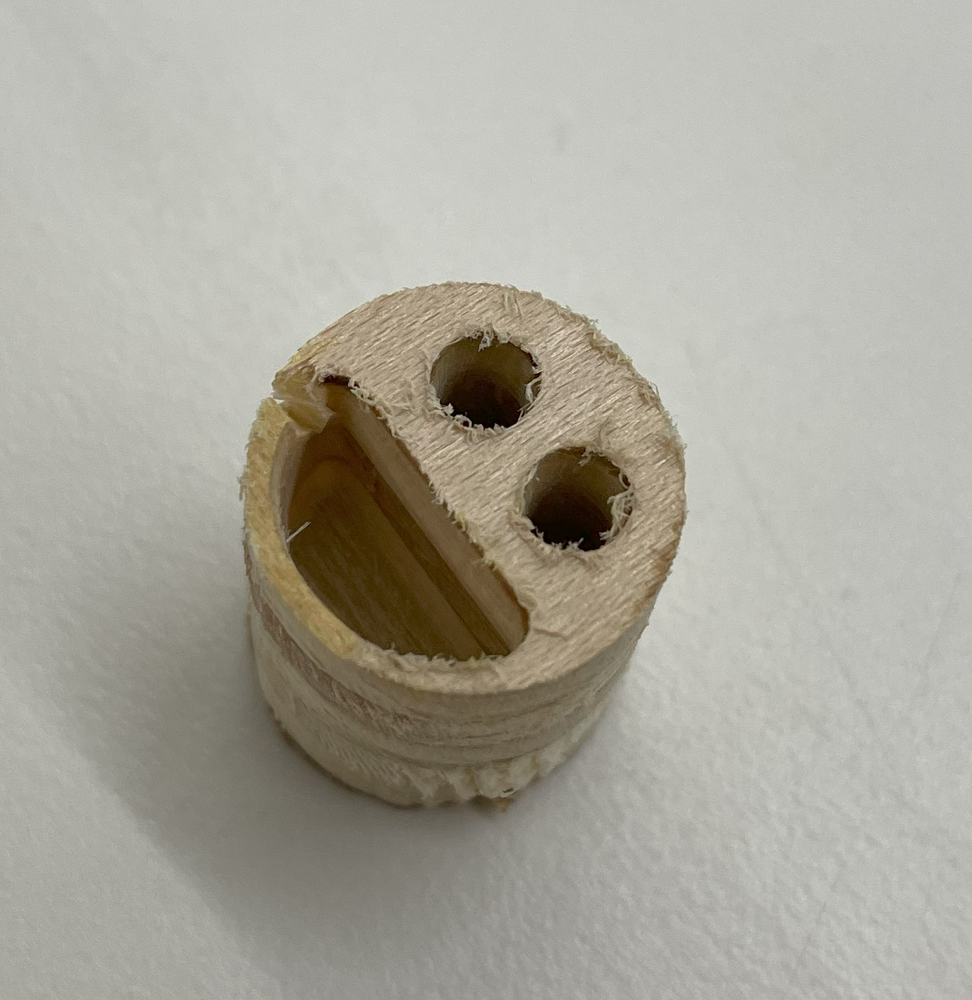
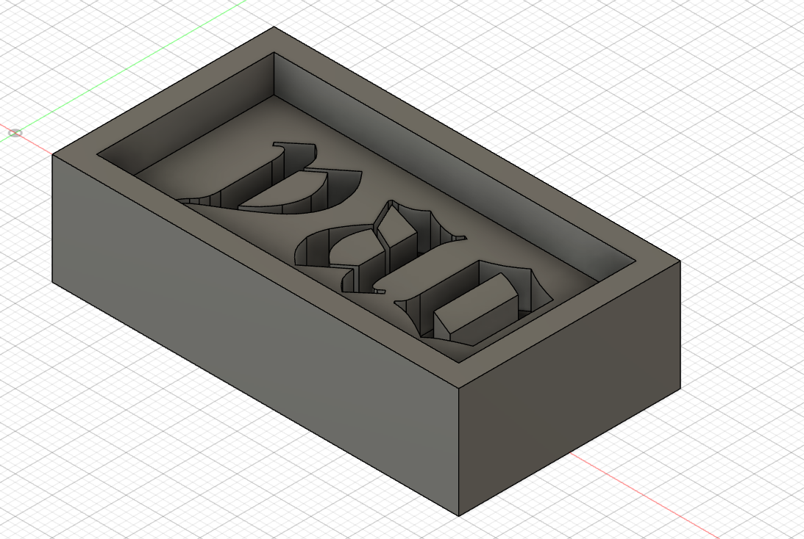
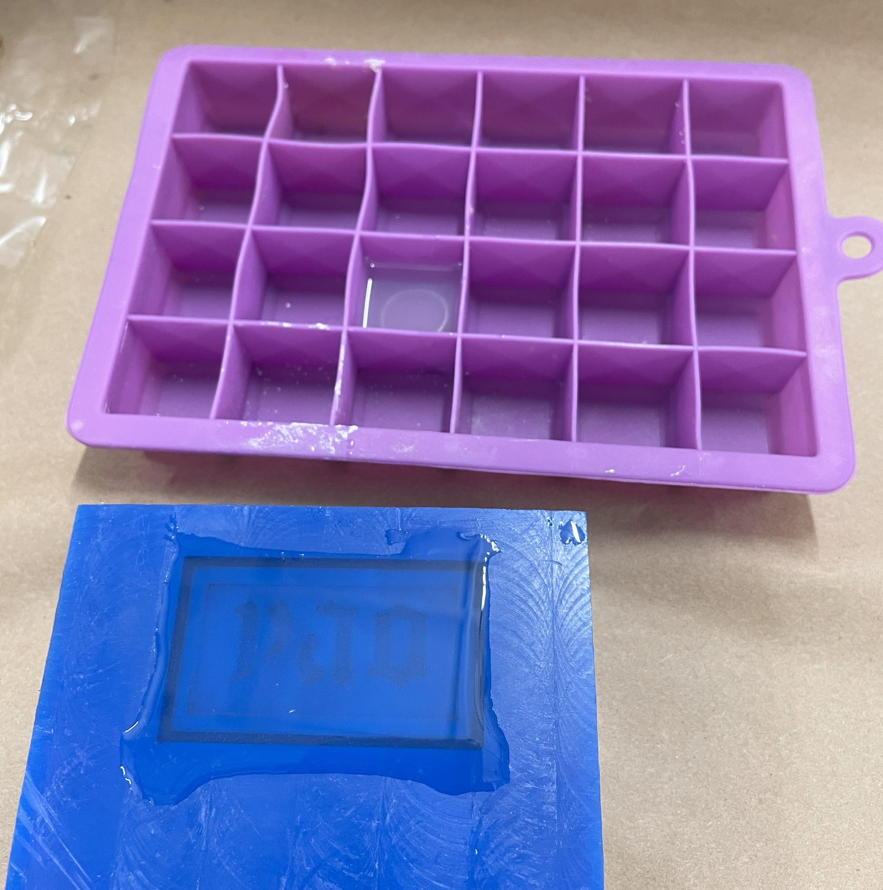
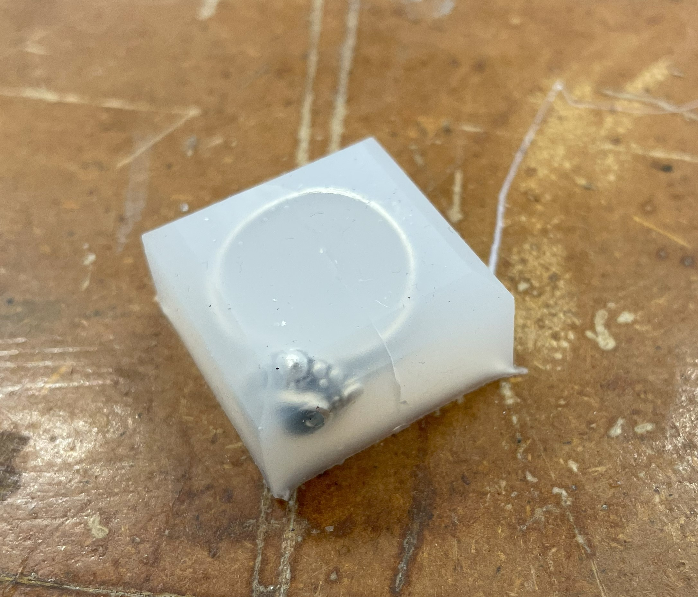
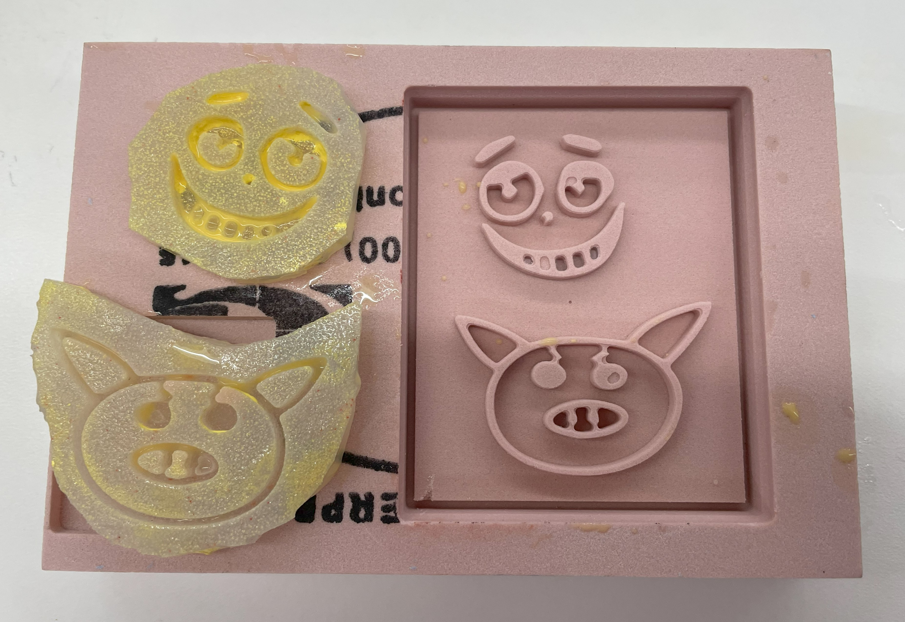
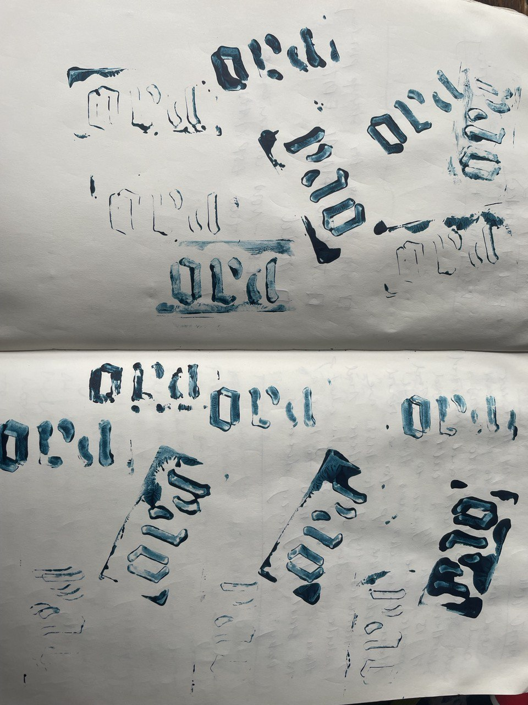

# CNC Milling & Molding

I started this assignment late so my original plan was to make stamps for our drawing machine project. I was going to just mill some very small stamps that I can drill a hole and attach to our machine as a stamp.

    

        
    

    
 

    I first tried to make a very small smily face stamp on the big CNC milling machine out of plywood. The result was not very satisfying. I also learned that you can't directly pour mold into wood. I wasn't too keen on trying the vacuum forming step so I decided to switch to the SRM-20 and do some milling in wax. This way I can directly pour soft material into the wax mold and make stamps that way. <a href="https://downloadcenter.rolanddg.com/contents/manuals/SRM-20_USE_EN_R4.pdf">The user's manual for the SRM-20 can be found here.</a>

The software that the SRM-20 that is installed in the lab computer is SRP-Player is quite poporly designed. First of all it is very hard to adjust how deep I want it to be. The only way that I found to do so is to adjust the "cut material" height to be just around the depth of the entire design. I only tried the surface cutting (top only).

A huge issue that I encountered is the drill bit not being long enough to reach into the material. The cutable parts of the drill bit only really extend about 10mm and it is even less (~3-4mm) for smaller 1/16" and 1/32" bits. It was also hard to adjust the height of the design in the SRP-Player software. I would need to do very careful planning and change drill bits in between if I want to cut something deeper.

In the manual it says that it also works with MODELA Player 4 software, I have not tried that. Maybe it would be better.

Another issue I kept running into is zeroing the z-position. The drill bit cannot be moved when the cover of the Roland is open. But it is very hard to see where the drill bit is when the cover is closed and we also cannot use the "paper method" that is used to zero the CNC machine. The only way I found to really zero it was through very many trial and error using small steps. I have definitely jammed the drill bit into the wax block once or twice... luckily nothing broke.

    

        
    

    

        
    

    

        
    

Above is the "Yao stamp" that I designed in Fusion 360 and milled successfully after two failed attempts. I poured the soft silicon material ( ) directly into the mold and succesfully created a stamp! I also attempted to make a mold out of my ring by just putting it in the silicon. Unfortunately I wasn't too sure how to take it out of the mold and ended up breaking it. :(

    

        
    

 

I decided to make some more stamps. This time using a different material. However it wasn't too successful due to the fact that I did not try to get rid of the air bubbles in the silicon after I poured it in. The surface of these stamps ended up being very porous. But they still work as stamps!

Here are the results of how the stamps performed... I used paint here. Using a stamp pillow may produce better results. But in general the silicon material is not the best in catching ink. More experimentation with materials would be good. I hope to come back to this project later...

    

        
    

    

        
    

    

        
    

